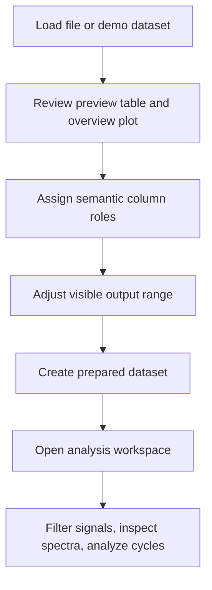

# EvalData

EvalData is a Python desktop application for loading, preparing, previewing, and analyzing measurement datasets.

Deeper project notes live in `docs/`, starting with `docs/technical-overview.md` and `docs/screenshots.md`.

User-facing documentation starts with `docs/quickstart.md` and `docs/user-guide.md`.

## Features

- dataset import and summary views
- preparation workflows for row-range selection, column-role assignment, and dataset splitting
- overview plotting in the main window
- a dedicated analysis workspace for filtering, spectral analysis, and cycle-oriented exploration
- demo datasets for validating workflows and signal-processing behavior

## Workflow Overview



## Requirements

- Python 3.12
- Windows-oriented local setup and packaging

## Local Setup

Create and activate a virtual environment, install dependencies, and launch the app:

```powershell
python -m venv .venv
.\.venv\Scripts\Activate.ps1
pip install -r requirements.txt
python EvalData.py
```

## Debugging In VS Code

The repository tracks `.vscode/launch.json` on purpose. It gives the project a shared debug profile that:

- starts `EvalData.py`
- runs from the workspace root
- uses the project-local `.venv` interpreter

That keeps debugger behavior aligned with the intended local setup.

## Build And Release

For a local executable build, use the helper script:

```powershell
python deploy.py
```

That script creates or reuses `.venv`, installs runtime dependencies plus PyInstaller, and builds the application.

You can also build directly from an activated environment:

```powershell
pyinstaller EvalData.py
```

Generated build artifacts are written to `build/` and `dist/` and are intentionally ignored by Git.

## Screenshots

The repository now reserves `docs/images/` for UI screenshots and `docs/screenshots.md` for a capture checklist and image index.

No screenshots are committed yet, but the structure is in place so the GitHub page can grow without changing the repo layout again.

## User Documentation

For non-expert users, start here:

- `docs/quickstart.md`: shortest path through the app using a demo dataset
- `docs/user-guide.md`: step-by-step normal workflow
- `docs/which-tool-when.md`: which part of the app to use for which job
- `docs/data-formats.md`: supported file types, inputs, and exports
- `docs/glossary.md`: plain-language definitions of the main terms
- `docs/faq.md`: common problems and practical fixes

## Project Layout

- `EvalData.py`: main application window and orchestration
- `analysis_workspace.py`: detailed per-dataset analysis window
- `evaldata_*.py`: layout, preview, plotting, demo, and preparation helpers
- `data_ops/`: pure dataframe and signal-processing helpers
- `deploy.py`: environment/bootstrap build helper

## Validation Status

There is currently no automated test suite in the repository. The current baseline has been checked with module import smoke tests and a compile-time pass.

## AI Assistance Notice

This repository is entirely AI-generated. The author did not write the code manually, and the codebase, documentation, and analysis behavior should be treated as unreviewed output.

Do not assume correctness, safety, or engineering validity. Before using this tool for real work, review and validate all important behavior manually, especially data parsing, transformations, exports, analysis results, and any engineering conclusions drawn from them.

## Documentation Approach

The repository uses Markdown for the primary documentation so it renders directly on Git hosting. A later LaTeX-based technical manual remains a good option for deeper theory, figures, and formal documentation.

Current documentation entry points:

- `docs/quickstart.md`: end-user getting-started guide
- `docs/user-guide.md`: end-user workflow reference
- `docs/which-tool-when.md`: task-to-tool guidance
- `docs/data-formats.md`: supported input and output behavior
- `docs/glossary.md`: plain-language terminology
- `docs/faq.md`: troubleshooting and common questions
- `docs/technical-overview.md`: architecture and workflow overview
- `docs/screenshots.md`: screenshot plan and image locations
