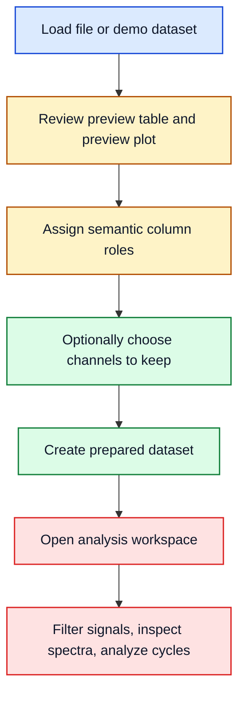

# EvalData

## AI Assistance Notice

This repository is entirely AI-generated. The author did not write the code manually, and the codebase, documentation, and analysis behavior should be treated as unreviewed output.

Do not assume correctness, safety, or engineering validity. Before using this tool for real work, review and validate all important behavior manually, especially data parsing, transformations, exports, analysis results, and any engineering conclusions drawn from them.

EvalData is a Python desktop application for loading, preparing, previewing, and analyzing measurement datasets.

The application has two working areas:

- the main window for loading data, checking it, assigning roles, and creating prepared datasets
- the analysis workspace for filtering, FFT/Welch, cycles, statistics, and exports on one selected dataset

## Start Here

- [docs/quickstart.md](docs/quickstart.md): one short demo run from load to FFT
- [docs/user-guide.md](docs/user-guide.md): normal user workflow and window orientation
- [docs/analysis-methods.md](docs/analysis-methods.md): short reference for filters, derived signals, spectra, cycles, and statistics
- [docs/technical-overview.md](docs/technical-overview.md): current package layout and runtime flow
- [docs/faq.md](docs/faq.md): practical troubleshooting

## Features

- dataset import and summary views
- preparation workflows for column-role assignment, optional channel selection, and dataset splitting
- preview plotting and table inspection in the main window
- a dedicated analysis workspace for filtering, spectral analysis, and cycle-oriented exploration
- demo datasets for reproducible walkthroughs and exploratory checks

## Workflow Overview



## Visual Checks

<p align="center">
	
</p>

Spectral reference demo: time-domain clean signal and its FFT amplitude spectrum.

<p align="center">
	
</p>

Same signal, two views: FFT amplitude vs Welch PSD on the input-output demo.

If these figures do not show in your preview, the image links are still valid on GitHub and in Markdown renderers that support inline HTML.

## Requirements

- Python 3.12
- Windows-oriented local setup and packaging

## Local Setup

Create and activate a virtual environment, install dependencies, and launch the app:

```powershell
python -m venv .venv
.\.venv\Scripts\Activate.ps1
pip install -r requirements.txt
python EvalData.py
```

`EvalData.py` remains the supported entry point at the repository root. It is intentionally thin and forwards into the packaged application code under `main_window/`.

## Debugging In VS Code

The repository tracks `.vscode/launch.json` on purpose. It gives the project a shared debug profile that:

- starts `EvalData.py`
- runs from the workspace root
- uses the project-local `.venv` interpreter

That keeps debugger behavior aligned with the intended local setup and with the thin launcher pattern used after the package split.

## Build And Release

For a local executable build, use the helper script:

```powershell
python deploy.py
```

That script creates or reuses `.venv`, installs runtime dependencies plus PyInstaller, and builds the application.

You can also build directly from an activated environment:

```powershell
pyinstaller EvalData.py
```

Generated build artifacts are written to `build/` and `dist/` and are intentionally ignored by Git.

## Documentation Map

- [docs/quickstart.md](docs/quickstart.md) for the shortest demo-based path
- [docs/user-guide.md](docs/user-guide.md) for the normal workflow, roles, and windows
- [docs/analysis-methods.md](docs/analysis-methods.md) for the current analysis methods and their functional meaning
- [docs/which-tool-when.md](docs/which-tool-when.md) for deciding between the main window and the analysis workspace
- [docs/technical-overview.md](docs/technical-overview.md) for architecture and runtime flow
- [docs/faq.md](docs/faq.md) for troubleshooting and common file/export issues
- [docs/data-formats.md](docs/data-formats.md) and [docs/glossary.md](docs/glossary.md) as short reference pages
- [docs/latex/README.md](docs/latex/README.md) for the full printable algorithm-note index, including FFT/Welch, filtering, derived signals, cycles, and statistics/correlation

## Project Layout

- `EvalData.py`: thin entry point for launching the application
- `main_window/`: main application window, preparation workflow, preview UI, plotting helpers, and demo datasets
- `analysis_workspace/`: detailed per-dataset analysis window and its supporting UI/state modules
- `data_ops/`: pure dataframe and signal-processing helpers
- `deploy.py`: environment/bootstrap build helper

The repository root is now intentionally kept thin: the launcher stays at the top level, while the main UI and analysis UI live in dedicated packages.

## Validation Status

This project is not meaningfully validated.

There is currently no automated test suite in the repository, no structured manual verification record, and no trustworthy basis for engineering confidence.

At most, there have been occasional editor checks, ad-hoc imports, and compile-time checks during development. Those are useful for catching syntax or packaging issues, but they do not validate data handling, analysis correctness, numerical stability, exports, or engineering conclusions.

## Current Preparation Caveat

Prepared dataset creation currently copies the full selected dataset and optionally keeps only the chosen columns. The overview plot is an inspection aid, not a row-trimming control. If you need separate row windows as standalone datasets, use `Preparation -> Split Into Subframes`.

## Documentation Approach

Markdown is the primary documentation format. LaTeX remains available for more formal printable notes when needed.

Practical pages should link forward into deeper notes when those notes exist. The current formal entry point is [docs/latex/README.md](docs/latex/README.md), with the first compiled example at [docs/latex/fft_welch_example.pdf](docs/latex/fft_welch_example.pdf).
