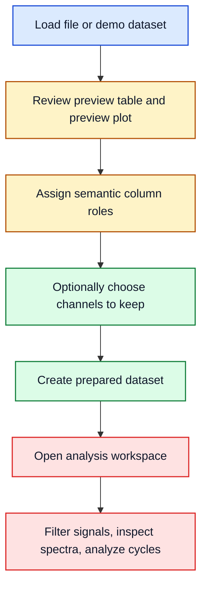

# EvalData

## AI Assistance Notice

This repository is entirely AI-generated. The author did not write the code manually, and the codebase, documentation, and analysis behavior should be treated as unreviewed output.

Do not assume correctness, safety, or engineering validity. Before using this tool for real work, review and validate all important behavior manually, especially data parsing, transformations, exports, analysis results, and any engineering conclusions drawn from them.

EvalData is a Python desktop application for loading, preparing, previewing, and analyzing measurement datasets.

The application has two working areas:

- the main window for loading data, checking it, assigning roles, and creating prepared datasets
- the analysis workspace for filtering, FFT/Welch, cycles, statistics, and exports on one selected dataset

## Start Here

- [Docs/quickstart.md](Docs/quickstart.md): one short demo run from load to FFT
- [Docs/user-guide.md](Docs/user-guide.md): normal user workflow and window orientation
- [Docs/analysis-methods.md](Docs/analysis-methods.md): short reference for filters, derived signals, spectra, cycles, and statistics
- [Docs/technical-overview.md](Docs/technical-overview.md): current package layout and runtime flow
- [Docs/faq.md](Docs/faq.md): practical troubleshooting

## Features

Canonical plotting is intentionally limited to four core types:

- preview plot
- time-series plot
- frequency plot
- cycle plot

The main window also provides an ad-hoc `Plot Data` popup for quick inspection, but it is not a separate core plot family.

- dataset import and summary views
- preparation workflows for column-role assignment, optional channel selection, and dataset splitting
- preview plotting and table inspection in the main window
- a dedicated analysis workspace with:
  - simple filtering (min/max masking)
  - signal processing (moving average, median, exponential smoothing, high-pass, Butterworth lowpass/highpass/bandpass)
  - derived signal creation (delta, ratio, rolling mean, derivative, normalized, detrend, integrate, RMS envelope, Hilbert envelope)
  - frequency analysis (FFT Amplitude, Welch PSD, Transfer Estimate, Coherence, Spectrogram)
  - cycle analysis (fixed-length, rising-edge, zero-crossing, peak detection)
  - resampling to a uniform time grid
  - engineering statistics and correlation matrices
  - interactive plotting with subplots and exports
- demo datasets for reproducible walkthroughs and exploratory checks

## Workflow Overview



## Visual Checks

<p align="center">
	
</p>

Spectral reference demo: time-domain clean signal and its FFT amplitude spectrum.

<p align="center">
	
</p>

Same signal, two views: FFT amplitude vs Welch PSD on the input-output demo.

If these figures do not show in your preview, the image links are still valid on GitHub and in Markdown renderers that support inline HTML.

## Requirements

- Python 3.12
- Windows-oriented local setup and packaging

## Local Setup

Create and activate a virtual environment, install dependencies, and launch the app:

```powershell
python -m venv .venv
.\.venv\Scripts\Activate.ps1
pip install -r requirements.txt
python EvalData.py
```

`EvalData.py` remains the supported entry point at the repository root. It is intentionally thin and forwards into the packaged application code under `Source/datapreparation_app/`.

## Debugging In VS Code

The repository tracks `.vscode/launch.json` on purpose. It gives the project a shared debug profile that:

- starts `EvalData.py`
- runs from the workspace root
- uses the project-local `.venv` interpreter

That keeps debugger behavior aligned with the intended local setup and with the thin launcher pattern used after the package split.

## Build And Release

For a local executable build, use the helper script:

```powershell
python deploy.py
```

That script creates or reuses `.venv`, installs runtime dependencies plus PyInstaller, and builds the application.

You can also build directly from an activated environment:

```powershell
pyinstaller EvalData.py
```

Generated build artifacts are written to `Build/` and `Dist/` and are intentionally ignored by Git.

## Documentation Map

- [Docs/quickstart.md](Docs/quickstart.md) for the shortest demo-based path
- [Docs/user-guide.md](Docs/user-guide.md) for the normal workflow, roles, and windows
- [Docs/analysis-methods.md](Docs/analysis-methods.md) for the current analysis methods and their functional meaning
- [Docs/which-tool-when.md](Docs/which-tool-when.md) for deciding between the main window and the analysis workspace
- [Docs/technical-overview.md](Docs/technical-overview.md) for architecture and runtime flow
- [Docs/faq.md](Docs/faq.md) for troubleshooting and common file/export issues
- [Docs/data-formats.md](Docs/data-formats.md) and [Docs/glossary.md](Docs/glossary.md) as short reference pages
- [Docs/latex/README.md](Docs/latex/README.md) for the full printable algorithm-note index, including FFT/Welch, filtering, derived signals, cycles, and statistics/correlation

## Project Layout

- `EvalData.py`: thin entry point for launching the application
- `Source/datapreparation_app/`: main application window, preparation workflow, preview UI, plotting helpers, and demo datasets
- `Source/analysis_app/`: detailed per-dataset analysis window and its supporting UI/state modules
- `Source/data_ops/`: pure dataframe and signal-processing helpers
- `Source/shared/`: shared UI contracts, plotting helpers, notifications, and documentation links
- `deploy.py`: environment/bootstrap build helper

The repository root is now intentionally kept thin: the launcher stays at the top level, while the main UI and analysis UI live in dedicated packages.

## Validation Status

The project includes an automated test suite with 261 tests covering all `data_ops` modules plus app-layer orchestration and workflow integration checks. Coverage includes spectral analysis (FFT, Welch, Transfer Estimate, Coherence, Spectrogram), signal processing (all 9 derived operations, all 7 filter operations), cycle detection (fixed-length, rising-edge, zero-crossing, peak), frame operations (select, drop, slice, split, normalize, resample), filtering (simple filter, subset), I/O (merge, analyze, export), summary statistics, preparation actions, analysis handlers, parser boundary behavior, shared plotting/lifecycle utilities, and cross-module preparation-to-analysis workflows.

Run the tests with:

```powershell
python -m pytest Tests/ -v
```

The UI layer (Tkinter) is not unit-tested. Manual verification is still recommended for interactive workflows and engineering conclusions.

## CI Test Gating

The repository now includes a GitHub Actions workflow at `.github/workflows/tests.yml`.

On every push and pull request, CI runs two checks:

- `Import boundary checks (3.12)`
- `Unit and app-layer tests (3.12)`
- `Integration workflow tests (3.12)`

Commands:

```powershell
python Scripts/check_import_boundaries.py
python -m pytest Tests -q -k "not workflows_integration"
python -m pytest Tests/test_workflows_integration.py -q
```

The boundary check is a hard gate and runs before the unit suite. The integration check is currently non-blocking in CI (`continue-on-error: true`) so it can be observed and stabilized first.

To enforce strict merge gates via branch protection:

1. Mark `Import boundary checks (3.12)` and `Unit and app-layer tests (3.12)` as required now.
2. Mark `Integration workflow tests (3.12)` as required after stabilization.

## Current Preparation Caveat

Prepared dataset creation currently copies the full selected dataset and optionally keeps only the chosen columns. The overview plot is an inspection aid, not a row-trimming control. If you need separate row windows as standalone datasets, use `Preparation -> Split Into Subframes`.

## Documentation Approach

Markdown is the primary documentation format. LaTeX remains available for more formal printable notes when needed.

Practical pages should link forward into deeper notes when those notes exist. The current formal entry point is [Docs/latex/README.md](Docs/latex/README.md), with the first compiled example at [Docs/latex/fft_welch_example.pdf](Docs/latex/fft_welch_example.pdf).
