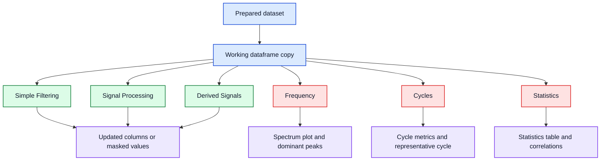

# Analysis Methods

## Purpose

This page is the short first-pass reference for the analysis methods that EvalData exposes in the analysis workspace.

It focuses on current behavior in the codebase, not on full theory. Deeper technical notes should move into `docs/latex/` over time when they need equations, derivations, or printable detail.

## Functional Map

Core rule: the analysis workspace operates on a working copy of the selected dataset. `Reset Working Data` restores that copy to the original loaded state for the current workspace session.

## Simple Filtering

`Simple Filtering` applies a min/max rule to the active column and writes the result to a column.

- It masks only the selected column.
- It does not remove rows from the dataframe.
- `Keep missing values` keeps `NaN` rows in the output column instead of filtering them away.
- If no output name is given, the app uses a `_filt` suffix.

Use it when you want to hide out-of-range values without changing the rest of the dataframe.

Reproducible demo example:

1. Load `Files -> Load Demo/Test Signal -> Spectral Reference Signal -> Load This Demo`.
2. Open the prepared dataset in the analysis workspace.
3. Set the active column to `structural_ringing`.
4. In `Simple Filtering`, use `Minimum = 0.2`, leave `Maximum` empty, and apply the filter.

Expected result: the new filtered column keeps only the larger ringing excursions while the dataframe row count stays unchanged.

## Signal Processing

`Signal Processing` creates a new filtered version of the active numeric column.

- `moving_average`: centered rolling mean for low-pass smoothing.
- `median`: centered rolling median for spike-resistant smoothing.
- `exponential_smoothing`: recursive smoothing controlled by `alpha`.
- `high_pass`: original signal minus a rolling-mean trend.

These operations keep the full dataframe and add or replace one derived signal column.

Reproducible demo examples:

- On the spectral reference demo, apply `moving_average` to `measured_signal` with a window such as `21` to reduce short-scale noise.
- On the same demo, apply `high_pass` to `measured_signal` with a wider window such as `101` to suppress drift and emphasize faster content such as impacts and ringing.

For a short formal note on the current filtering methods, see [latex/filtering_example.pdf](latex/filtering_example.pdf).

## Derived Signals

`Derived Signals` creates a new numeric column from the active column.

- `delta`: first difference between adjacent samples.
- `ratio`: source divided by a second column, with zero denominators suppressed to `NaN`.
- `rolling_mean`: moving average written as a new derived column.
- `derivative`: $dy/dx$ using a reference column or the row index.
- `normalized`: z-score normalization, or mean-centering when the standard deviation is zero.

Use these when the original channel is less informative than its change, ratio, trend, or normalized form.

Reproducible demo examples:

- On the spectral reference demo, create `delta` from `measured_signal` to highlight abrupt sample-to-sample changes.
- On the same demo, create `derivative` from `measured_signal` using `time_s` as the reference column to estimate rate of change.
- On the input-output demo, create `normalized` from `system_output` when you want a scale-free comparison against other channels.

For the formal note on the current derived-signal operations, see [latex/derived_signals_example.pdf](latex/derived_signals_example.pdf).

## Frequency

The current frequency tab exposes two methods:

- `FFT Amplitude`: one-sided amplitude spectrum for dominant frequency inspection.
- `Welch PSD`: averaged power spectral density estimate for smoother spectral inspection.

Current behavior:

- If you choose `X / reference`, the app estimates spacing from the median step in that column.
- If you leave the reference on `Index`, the app uses the manual step size.
- Window options are `hann`, `hamming`, `blackman`, and `rectangular`.
- `Remove trend before analysis` subtracts the mean before the spectrum calculation.
- The result view shows both the plotted spectrum and a ranked peak table.

For the current formal note behind these two methods, see [latex/fft_welch_example.pdf](latex/fft_welch_example.pdf).

Technical note: the lower-level spectral module also contains transfer-estimate and coherence helpers, but the current UI method selector only exposes `FFT Amplitude` and `Welch PSD`.

Reproducible demo examples:

- On the spectral reference demo, analyze `clean_signal` with `FFT Amplitude`, `X / reference = time_s`, and a `hann` window. Expected dominant peaks are near `1.0`, `7.5`, and `18.0 Hz`.
- On the same demo, switch to `Welch PSD` on `measured_signal` when you want a smoother spectrum with visible low-frequency drift and ringing content.

## Cycles

The cycle tab currently supports two modes:

- `fixed_length`: split the active signal into equal row blocks.
- `rising_edge`: detect cycle boundaries from threshold crossings on a reference signal.

Both modes produce:

- per-cycle metrics such as mean, standard deviation, RMS, and peak-to-peak
- an aligned cycle matrix trimmed to a common cycle length
- a representative cycle summary with mean, spread, min, and max

Use `fixed_length` when the row count per cycle is already known. Use `rising_edge` when one channel marks repeat boundaries more clearly than a fixed block size.

Reproducible demo examples:

- On the spectral reference demo, use `fixed_length` with `cycle_length = 250`. The built-in impact train repeats every `0.5 s` at `500 Hz`, so `250` rows is a natural first check.
- On the same demo, use `rising_edge` with `Reference = impact_marker`, `Threshold = 0.5`, and `Cycle length = 200` as the minimum accepted cycle size.

Expected result: both modes should recover repeated segments from the same deterministic demo, but the threshold-based mode follows the marker channel explicitly.

For the formal note on the current cycle workflow, see [latex/cycle_analysis_example.pdf](latex/cycle_analysis_example.pdf).

## Statistics

The statistics tab is a read-only summary of the current working dataframe.

- The statistics table reports count, missing values, min, max, mean, standard deviation, RMS, and peak-to-peak for numeric columns.
- The correlation view shows a numeric correlation matrix and highlights strong positive and negative values.

This is useful for checking whether later transformations changed the signal the way you expected.

Reproducible demo example:

On the spectral reference demo, compare `clean_signal`, `measured_signal`, and `response_signal` in `Statistics`. `measured_signal` should show extra spread from drift, ringing, and noise, while `clean_signal` stays simpler and more concentrated.

For the formal note on engineering statistics and correlation, see [latex/statistics_correlation_example.pdf](latex/statistics_correlation_example.pdf).

## Boundaries And Current Gaps

- The analysis workspace edits only its working copy, not the original loaded dataset in place.
- `Export Current View` exports the current working dataframe state.
- Row-based structural splitting belongs in the main window under `Preparation -> Split Into Subframes`, not in the analysis workspace.
- Formal LaTeX coverage now exists for the current user-visible method families: spectral analysis, filtering, derived signals, cycles, and statistics/correlation.
- Lower-level transfer-estimate and coherence helpers still exist in code, but they are not part of the current documented UI workflow.

Related pages:

- [user-guide.md](user-guide.md) for the practical workflow
- [which-tool-when.md](which-tool-when.md) for window-level decisions
- [technical-overview.md](technical-overview.md) for package layout and runtime flow
- [latex/README.md](latex/README.md) for formal notes