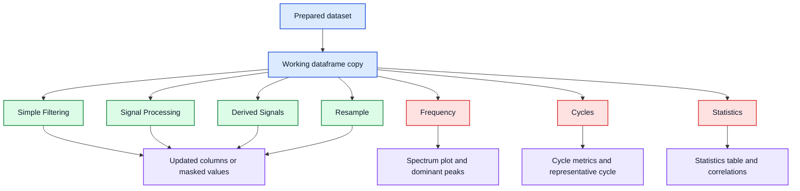

# Analysis Methods

## Purpose

This page is the short first-pass reference for the analysis methods that EvalData exposes in the analysis workspace.

It focuses on current behavior in the codebase, not on full theory. Deeper technical notes should move into `docs/latex/` over time when they need equations, derivations, or printable detail.

## Functional Map

Core rule: the analysis workspace operates on a working copy of the selected dataset. `Reset Working Data` restores that copy to the original loaded state for the current workspace session.

## Inferred Defaults And Field Badges

Several spacing and length controls can be auto-filled from the current data when you have not manually set a value yet.

- Signal-processing sample spacing
- FFT index step size
- Resample target spacing (when a real time column is selected)
- Welch segment length
- Fixed-cycle length

Each of these fields shows a live badge:

- `Inferred`: value is currently data-derived by the workspace
- `User-set`: value was manually edited and is no longer auto-overwritten

This keeps first-run analysis usable without hiding whether a value came from your input or from workspace inference.

## Simple Filtering

`Simple Filtering` applies a min/max rule to the active column and writes the result to a column.

- It masks only the selected column.
- It does not remove rows from the dataframe.
- `Keep missing values` keeps `NaN` rows in the output column instead of filtering them away.
- If no output name is given, the app uses a `_filt` suffix.

Use it when you want to hide out-of-range values without changing the rest of the dataframe.

Reproducible demo example:

1. Load `Files -> Load Demo/Test Signal -> Spectral Reference Signal -> Load This Demo`.
2. Open the prepared dataset in the analysis workspace.
3. Set the active column to `structural_ringing`.
4. In `Simple Filtering`, use `Minimum = 0.2`, leave `Maximum` empty, and apply the filter.

Expected result: the new filtered column keeps only the larger ringing excursions while the dataframe row count stays unchanged.

## Signal Processing

`Signal Processing` creates a new filtered version of the active numeric column.

**Window-based filters:**

| Filter | Required parameter | Notes |
|---|---|---|
| `moving_average` | `window_size > 0` | Centered rolling mean. |
| `median` | `window_size > 0` | Centered rolling median, spike-resistant. |
| `exponential_smoothing` | `alpha > 0` | Recursive decay; α close to 1 = fast decay. |
| `high_pass` | `window_size > 0` | Original minus rolling-mean trend. |

**Butterworth filters (zero-phase, `sosfiltfilt`):**

| Filter | Required parameters | Notes |
|---|---|---|
| `butterworth_lowpass` | `cutoff_hz > 0`, `sample_spacing > 0`, `filter_order > 0` | Zero-phase LP. |
| `butterworth_highpass` | `cutoff_hz > 0`, `sample_spacing > 0`, `filter_order > 0` | Zero-phase HP. |
| `butterworth_bandpass` | `cutoff_hz > 0`, `cutoff_hz_high > cutoff_hz`, `sample_spacing > 0`, `filter_order > 0` | Zero-phase BP with a low/high cutoff pair. |

All Butterworth variants use `scipy.signal.sosfiltfilt` for zero-phase filtering, which avoids the phase distortion of a single-pass IIR filter at the cost of doubling the effective filter order.

These operations keep the full dataframe and add or replace one derived signal column.

Reproducible demo examples:

- On the spectral reference demo, apply `moving_average` to `measured_signal` with a window such as `21` to reduce short-scale noise.
- On the same demo, apply `high_pass` to `measured_signal` with a wider window such as `101` to suppress drift and emphasize faster content such as impacts and ringing.
- On the same demo, apply `butterworth_lowpass` with cutoff `10 Hz`, order `4`, and the correct sample spacing to isolate the low-frequency components of `measured_signal`.

For a short formal note on the current filtering methods, see [latex/filtering_example.pdf](latex/filtering_example.pdf).

## Derived Signals

`Derived Signals` creates a new numeric column from the active column.

- `delta`: first difference between adjacent samples.
- `ratio`: source divided by a second column, with zero denominators suppressed to `NaN`.
- `rolling_mean`: moving average written as a new derived column.
- `derivative`: $dy/dx$ using a reference column or the row index.
- `normalized`: z-score normalization, or mean-centering when the standard deviation is zero.
- `detrend`: subtract a fitted polynomial trend (order 1–3, controlled by the window-size parameter).
- `integrate`: cumulative trapezoidal integration using a reference column for the time step.
- `rms_envelope`: rolling RMS computed over a centered window, useful for tracking instantaneous signal energy.
- `hilbert_envelope`: amplitude envelope of the analytic signal via the Hilbert transform, useful for extracting the modulation envelope of narrowband signals.

Use these when the original channel is less informative than its change, ratio, trend, or normalized form.

Reproducible demo examples:

- On the spectral reference demo, create `delta` from `measured_signal` to highlight abrupt sample-to-sample changes.
- On the same demo, create `derivative` from `measured_signal` using `time_s` as the reference column to estimate rate of change.
- On the input-output demo, create `normalized` from `system_output` when you want a scale-free comparison against other channels.
- On the spectral reference demo, create `detrend` from `measured_signal` with window size `1` (linear detrend) to remove slow drift before frequency analysis.
- On the same demo, create `rms_envelope` from `measured_signal` with a window such as `51` to track how the signal energy varies over time.
- On the same demo, create `hilbert_envelope` from `clean_signal` to extract the amplitude modulation envelope without windowing artifacts.

For the formal note on the current derived-signal operations, see [latex/derived_signals_example.pdf](latex/derived_signals_example.pdf).

## Frequency

The frequency tab exposes five methods:

| Method | Required parameters | Notes |
|---|---|---|
| `FFT Amplitude` | `sample_spacing > 0` | One-sided amplitude spectrum. |
| `Welch PSD` | `sample_spacing > 0`, `segment_length > 0` | Averaged PSD estimate. |
| `Transfer Estimate` | `comparison_signal` (non-empty), `sample_spacing > 0`, `segment_length > 0` | Frequency response magnitude and phase. |
| `Coherence` | `comparison_signal` (non-empty), `sample_spacing > 0`, `segment_length > 0` | Magnitude-squared coherence 0–1. |
| `Spectrogram` | `sample_spacing > 0`, `segment_length > 0` | Time-frequency heatmap. |

Current behavior:

- If you choose `X / reference`, the app estimates spacing from the median step in that column.
- If you leave the reference on `Index`, the app uses the manual step size.
- Window options are `hann`, `hamming`, `blackman`, and `rectangular`.
- `Remove trend before analysis` subtracts the mean before the spectrum calculation.
- The result view shows both the plotted spectrum and a ranked peak table (except for the spectrogram, which shows a heatmap).
- `Transfer Estimate` and `Coherence` require a comparison column to be set; without it, the analysis cannot run.

For the current formal note behind FFT and Welch, see [latex/fft_welch_example.pdf](latex/fft_welch_example.pdf).

Reproducible demo examples:

- On the spectral reference demo, analyze `clean_signal` with `FFT Amplitude`, `X / reference = time_s`, and a `hann` window. Expected dominant peaks are near `1.0`, `7.5`, and `18.0 Hz`.
- On the same demo, switch to `Welch PSD` on `measured_signal` when you want a smoother spectrum with visible low-frequency drift and ringing content.
- On the input-output demo, use `Transfer Estimate` with the input signal as the comparison column and the output signal as the active column to inspect the frequency response magnitude and phase.
- On the input-output demo, use `Coherence` with the same pair to check at which frequencies the input-output relationship is linear and strong.
- On the spectral reference demo, use `Spectrogram` on `measured_signal` to observe how the frequency content changes across the recording duration.

## Cycles

The cycle tab supports four detection modes:

- `fixed_length`: split the active signal into equal row blocks of a given size.
- `rising_edge`: detect cycle boundaries from rising threshold crossings on a reference signal.
- `zero_crossing`: detect cycles between rising zero-crossing points on a reference signal.
- `peak`: detect cycles between successive peaks of a reference signal using `scipy.signal.find_peaks`. Supports a `prominence` filter to ignore minor peaks.

All modes produce:

- per-cycle metrics such as mean, standard deviation, RMS, and peak-to-peak
- an aligned cycle matrix trimmed to a common cycle length
- a representative cycle summary with mean, spread, min, and max

Use `fixed_length` when the row count per cycle is already known. Use `rising_edge` when one channel marks repeat boundaries more clearly than a fixed block size. Use `zero_crossing` when cycles naturally correspond to sign changes (e.g. oscillating signals). Use `peak` when cycles are best defined by successive signal peaks (e.g. impact events or vibration bursts) and set `prominence` to skip small peaks.

Reproducible demo examples:

- On the spectral reference demo, use `fixed_length` with `cycle_length = 250`. The built-in impact train repeats every `0.5 s` at `500 Hz`, so `250` rows is a natural first check.
- On the same demo, use `rising_edge` with `Reference = impact_marker`, `Threshold = 0.5`, and `Cycle length = 200` as the minimum accepted cycle size.
- On the same demo, use `zero_crossing` with `Reference = clean_signal` and a minimum cycle length to segment the underlying oscillation.
- On the same demo, use `peak` with `Reference = impact_marker` and a `prominence` value to segment the response around successive significant peaks.

For the formal note on the current cycle workflow, see [latex/cycle_analysis_example.pdf](latex/cycle_analysis_example.pdf).

For a practical interpretation guide with annotated screenshots (controls, metrics table, representative cycle, and cycle-to-cycle trends), see [cycle-analysis-guide.md](cycle-analysis-guide.md).

## Statistics

The statistics tab is a read-only summary of the current working dataframe.

- The statistics table reports count, missing values, min, max, mean, standard deviation, RMS, and peak-to-peak for numeric columns.
- The correlation view shows a numeric correlation matrix and highlights strong positive and negative values.

This is useful for checking whether later transformations changed the signal the way you expected.

Reproducible demo example:

On the spectral reference demo, compare `clean_signal`, `measured_signal`, and `response_signal` in `Statistics`. `measured_signal` should show extra spread from drift, ringing, and noise, while `clean_signal` stays simpler and more concentrated.

For the formal note on engineering statistics and correlation, see [latex/statistics_correlation_example.pdf](latex/statistics_correlation_example.pdf).

## Resample

The `Resample` sub-tab (inside the `Filter` tab) interpolates all numeric columns onto a uniform time grid.

- Select the time column and specify the target spacing.
- The operation uses `resample_to_uniform` from `data_ops/frame_ops.py`.
- This replaces the entire working dataframe with the resampled version.

Use it when non-uniform sample spacing would distort frequency analysis or when downstream processing expects evenly spaced data.

## Boundaries And Current Gaps

- The analysis workspace edits only its working copy, not the original loaded dataset in place.
- `Export Current View` exports the current working dataframe state.
- Row-based structural splitting belongs in the main window under `Preparation -> Split Into Subframes`, not in the analysis workspace.
- Formal LaTeX coverage now exists for the current user-visible method families: spectral analysis, filtering, derived signals, cycles, and statistics/correlation.
- Formal LaTeX notes for Transfer Estimate, Coherence, Spectrogram, Butterworth filters, and the newer derived-signal operations (detrend, integrate, rms_envelope, hilbert_envelope) do not yet exist.

Related pages:

- [user-guide.md](user-guide.md) for the practical workflow
- [which-tool-when.md](which-tool-when.md) for window-level decisions
- [technical-overview.md](technical-overview.md) for package layout and runtime flow
- [latex/README.md](latex/README.md) for formal notes