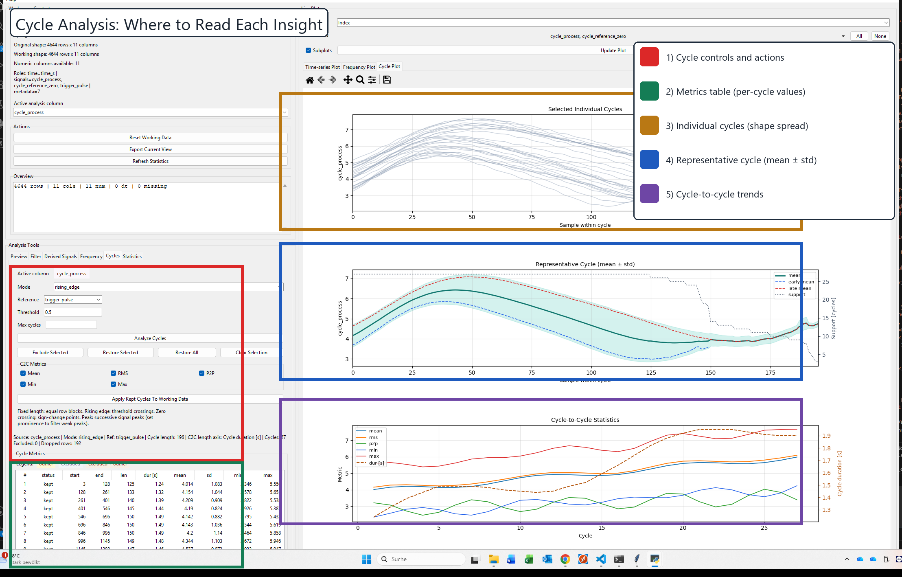
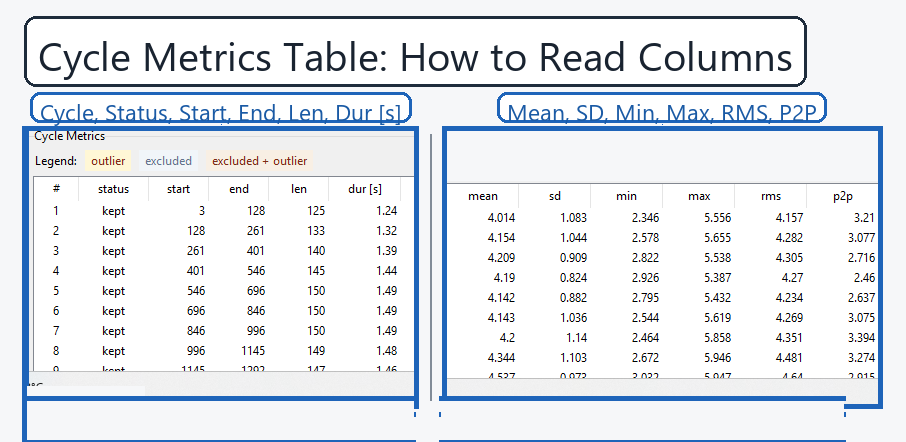

# Cycle Analysis Guide

This page explains what information you can extract from cycle analysis, where that information appears in the UI, and how to interpret it for decisions.

## Visual Map

The two annotated figures below are generated from the `Cycle Validation Drift Signal` demo dataset, so they show cycle-analysis behavior on purpose-built cycle data.

## What You Can Learn

From one cycle-analysis run, you can answer these questions:

- How many cycles were detected and kept.
- Whether your detection logic is stable across the dataset.
- How cycle duration or cycle length changes over time.
- Whether cycle amplitude/energy drifts over time.
- Whether early and late behavior differ (warming, wear, setup drift).
- Which cycles are likely outliers and should be reviewed or excluded.

## Where To Find Each Insight

### 1) Cycle Controls (left panel)

Use this area to define cycle boundaries and quality filtering:

- `Mode`: `fixed_length`, `rising_edge`, `zero_crossing`, `peak`
- Detection parameters:
  - `Cycle length` for `fixed_length`
  - `Reference` + `Threshold` for `rising_edge`
  - `Reference` for `zero_crossing` (rising crossings)
  - `Reference` + `Prominence` for `peak`
- `Analyze Cycles`: runs segmentation + metrics.
- Exclusion workflow buttons:
  - `Exclude Selected`
  - `Restore Selected`
  - `Restore All`
  - `Clear Selection`
- `Apply Kept Cycles To Working Data`: commits only kept-cycle row ranges to the working dataframe.

### 2) Summary Line (below controls)

The summary text reports run metadata, including:

- source signal
- detection mode
- reference channel
- cycle length
- cycle count
- excluded cycles
- dropped rows

Use this as a first sanity check before reading plots.

### 3) Cycle Metrics Table (bottom-left)

Per-cycle columns include:

- `cycle`, `status`
- `start`, `end`
- `len` and possibly `dur [s]`
- `mean`, `sd`, `min`, `max`, `rms`, `p2p`

Row coloring:

- yellow: outlier
- gray: excluded
- beige: excluded + outlier

Practical use:

- Sort by `dur [s]` (or `len`) to find timing instabilities.
- Sort by `rms`/`p2p` to find amplitude-energy anomalies.
- Sort by `mean` to detect baseline drift.

### 4) Selected Individual Cycles (top plot)

Shows overlaid traces for selected cycles.

Use it to detect:

- shape consistency
- phase jitter
- occasional spikes or clipping

If traces are highly scattered, revisit detection settings before concluding physics.

### 5) Representative Cycle (middle plot)

Shows mean cycle and variability band.

Includes:

- mean profile
- spread (standard deviation band)
- early vs late mean curves

Interpretation:

- Large spread band means poor repeatability or mixed operating regimes.
- Early/late separation suggests thermal drift, wear-in, or load drift.

### 6) Cycle-to-Cycle Statistics (bottom plot)

Shows metric trends vs cycle index.

Typical lines:

- `mean`, `rms`, `p2p`, `min`, `max`
- right axis: `dur [s]` when available

Use it to detect:

- monotonic drift
- periodic modulation
- sudden jumps after events

## Recommended Review Workflow

1. Pick detection mode and parameters.
2. Run `Analyze Cycles`.
3. Check summary line for cycle count/exclusions/dropped rows.
4. Scan metrics table for outliers and extreme values.
5. Inspect top plot for shape consistency.
6. Inspect middle plot for early-vs-late shift and spread.
7. Inspect bottom plot for drift and periodic behavior.
8. Exclude abnormal cycles and rerun interpretation.
9. Apply kept cycles to working data only when segmentation quality is acceptable.

## Mode Selection Hints

- `fixed_length`: best when cycle length is known and approximately constant.
- `rising_edge`: best when a trigger-like reference channel exists.
- `zero_crossing`: best for oscillatory references with clean sign changes.
- `peak`: best for pulse/impact-like structures; tune prominence to suppress noise peaks.

## Typical Engineering Readouts

Examples of quantitative statements you can extract directly:

- "Detected 102 cycles; excluded 3 outliers; dropped rows: 18."
- "Cycle duration median: 0.198 s with low dispersion."
- "RMS increases over cycle index, suggesting progressive load/temperature effect."
- "Early vs late representative curves diverge near sample 55, indicating shape evolution."

## Related Docs

- [analysis-methods.md](analysis-methods.md)
- [user-guide.md](user-guide.md)
- [latex/cycle_analysis_example.pdf](latex/cycle_analysis_example.pdf)