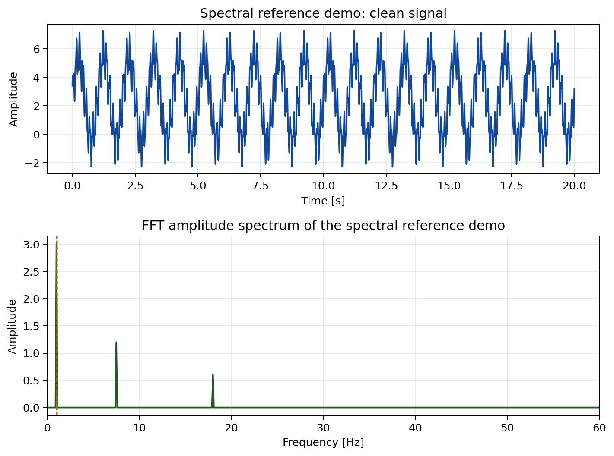
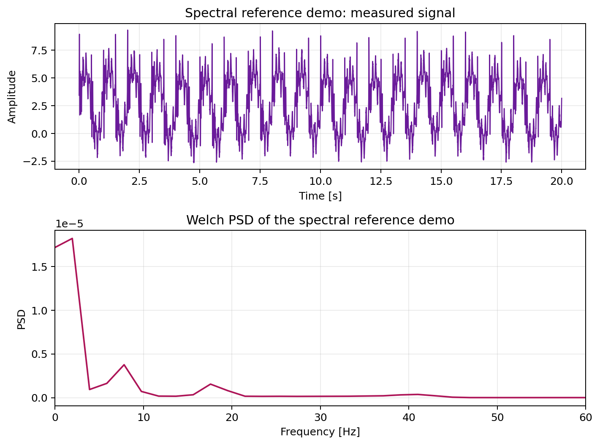
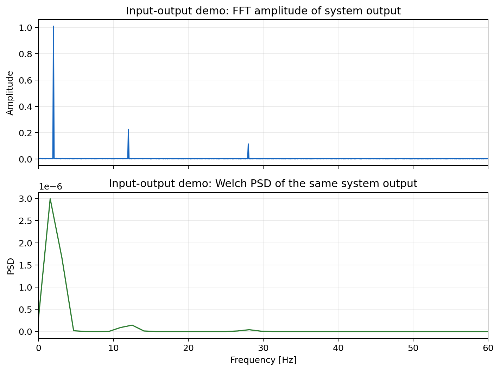
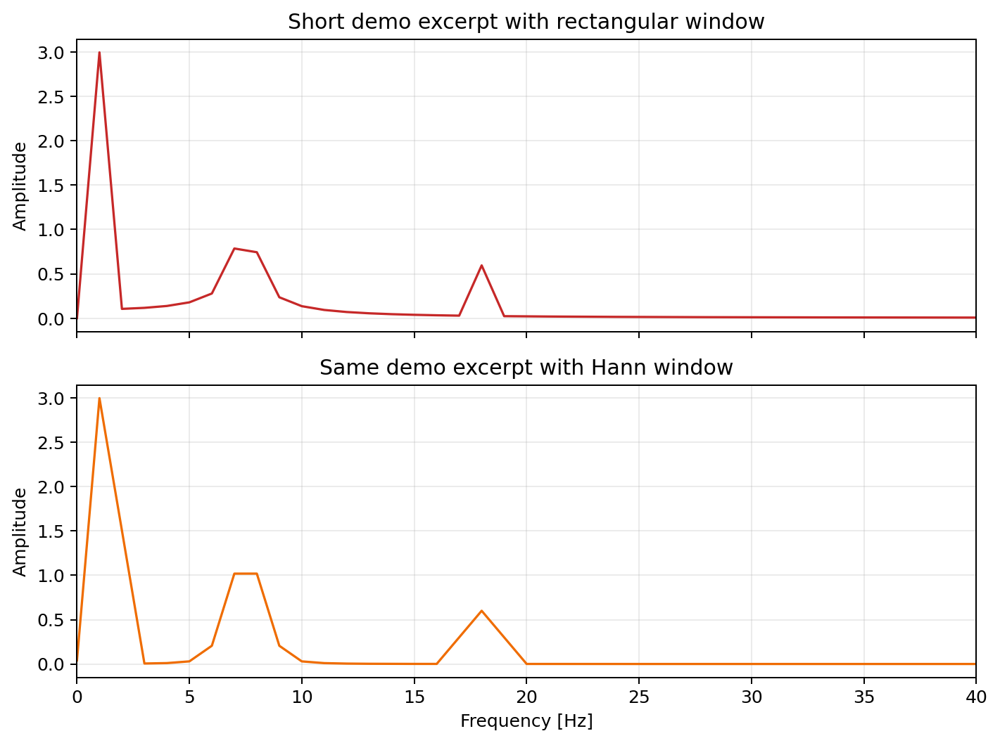

# LaTeX Notes

This folder contains formal algorithm notes written in LaTeX.

Current example:

- `fft_welch_example.tex`: source document
- `fft_welch_example.pdf`: compiled PDF output

Generated figures used by the example live in `docs/images/algorithms/`.

These figures are generated from the same built-in demo datasets that the app exposes in the `Load Demo/Test Signal` menu.

## Purpose

The Markdown docs explain how to use the app. The LaTeX notes are for deeper technical explanations where equations, structured sections, and printable output are useful.

## Build

From the repository root, compile the example with:

```powershell
pdflatex -output-directory docs/latex docs/latex/fft_welch_example.tex
```

Run the command again if you later add cross-references or a table of contents that needs a second pass.

## Figures

The repository also includes a small reproducible figure generator:

```powershell
python docs/generate_algorithm_figures.py
```

Current generated images:








