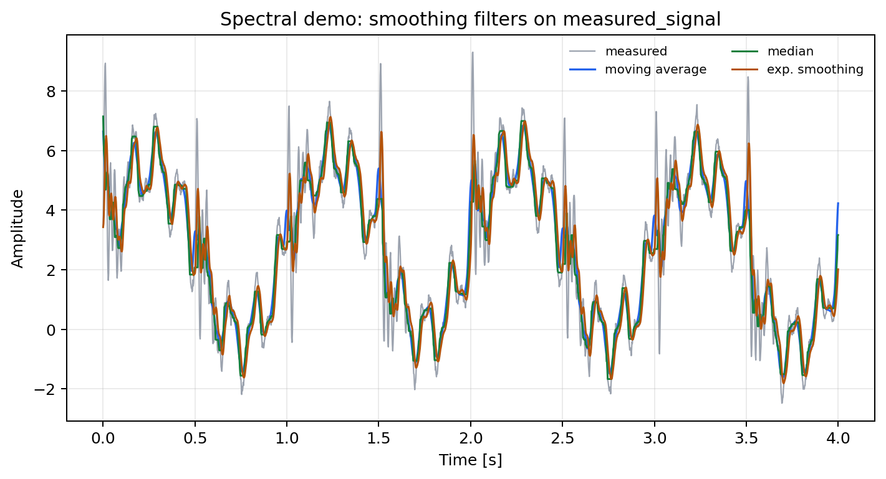
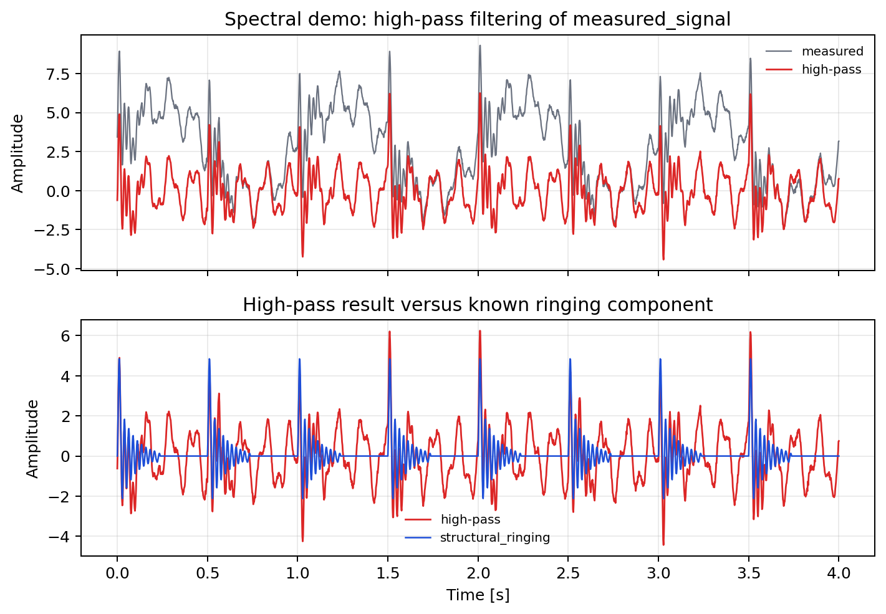
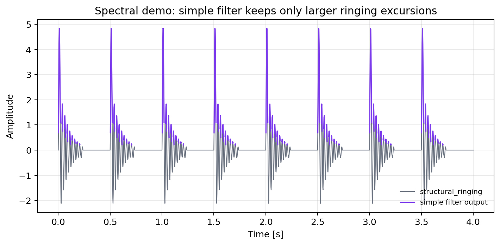
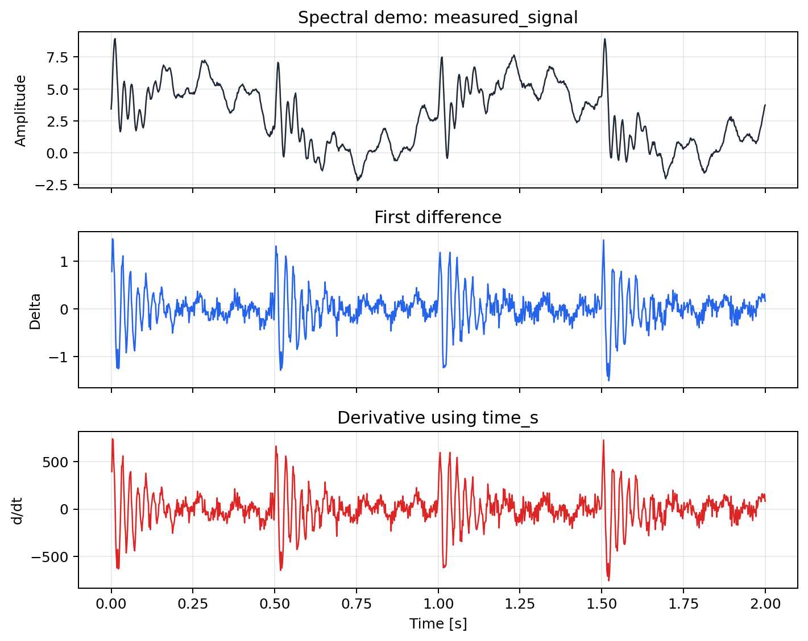
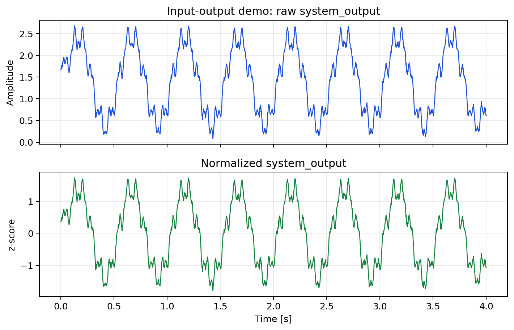
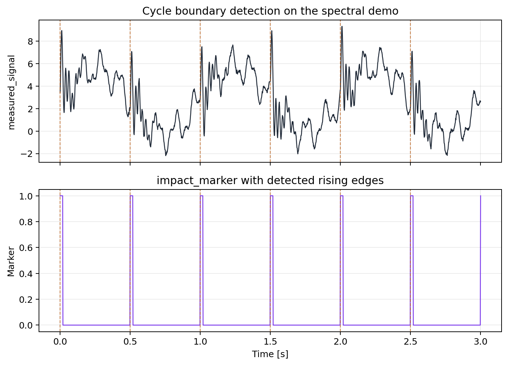
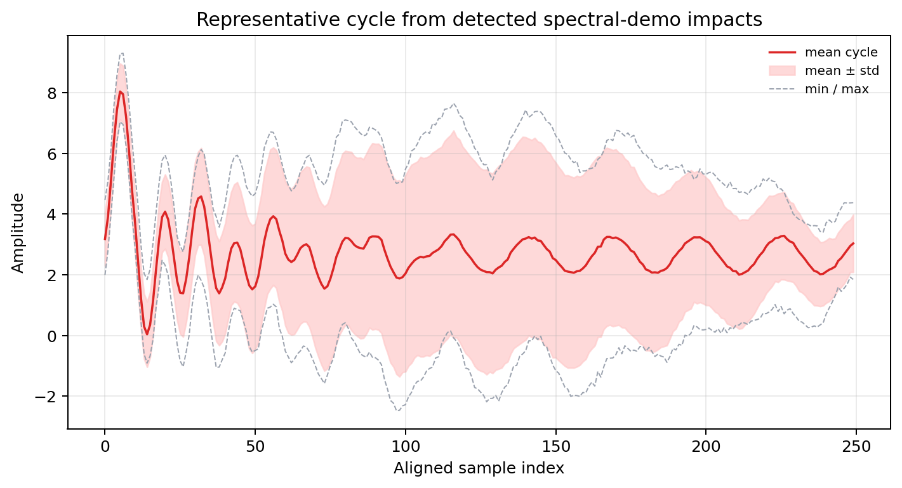
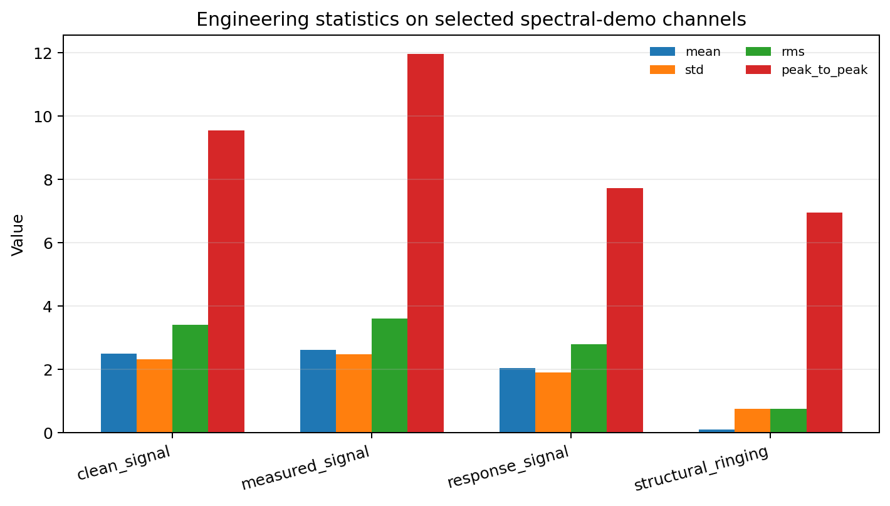
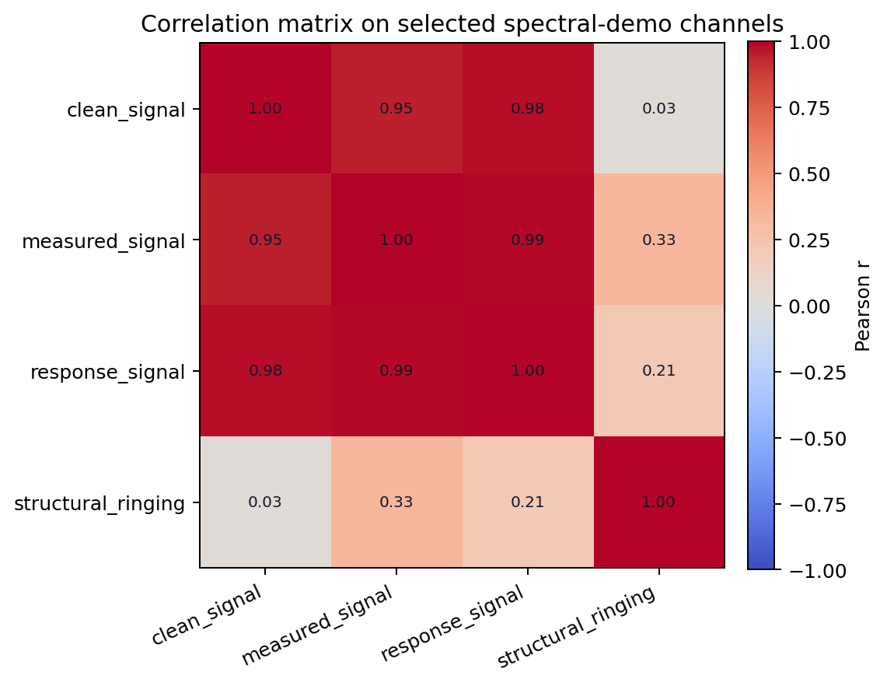

# LaTeX Notes

This folder contains formal algorithm notes written in LaTeX.

Current example:

- `fft_welch_example.tex`: source document
- `fft_welch_example.pdf`: compiled PDF output
- `filtering_example.tex`: source document
- `filtering_example.pdf`: compiled PDF output
- `derived_signals_example.tex`: source document
- `derived_signals_example.pdf`: compiled PDF output
- `cycle_analysis_example.tex`: source document
- `cycle_analysis_example.pdf`: compiled PDF output
- `statistics_correlation_example.tex`: source document
- `statistics_correlation_example.pdf`: compiled PDF output

Generated figures used by the example live in `docs/images/algorithms/`.

These figures are generated from the same built-in demo datasets that the app exposes in the `Load Demo/Test Signal` menu.

## Purpose

The Markdown docs explain how to use the app. The LaTeX notes are for deeper technical explanations where equations, structured sections, and printable output are useful.

Related Markdown entry points:

- [README.md](../../README.md) for the documentation map
- [docs/user-guide.md](../user-guide.md) for the practical workflow
- [docs/analysis-methods.md](../analysis-methods.md) for the short method-level reference
- [docs/technical-overview.md](../technical-overview.md) for architecture and runtime flow

Current coverage now matches the current user-visible analysis method families: spectral analysis, filtering, derived signals, cycles, and statistics/correlation.

Lower-level transfer-estimate and coherence helpers still exist in code, but they are not part of the current documented UI workflow and are therefore not described here as active user-facing features.

## Build

From the repository root, compile the example with:

```powershell
pdflatex -output-directory docs/latex docs/latex/fft_welch_example.tex
pdflatex -output-directory docs/latex docs/latex/filtering_example.tex
pdflatex -output-directory docs/latex docs/latex/derived_signals_example.tex
pdflatex -output-directory docs/latex docs/latex/cycle_analysis_example.tex
pdflatex -output-directory docs/latex docs/latex/statistics_correlation_example.tex
```

Run the command again if you later add cross-references or a table of contents that needs a second pass.

## Figures

The repository also includes a small reproducible figure generator:

```powershell
python docs/generate_algorithm_figures.py
```

Current generated images:



















