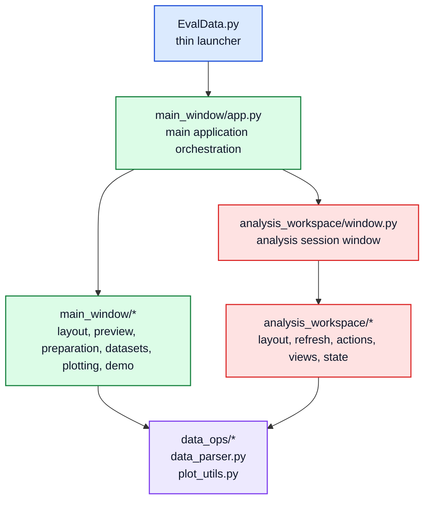
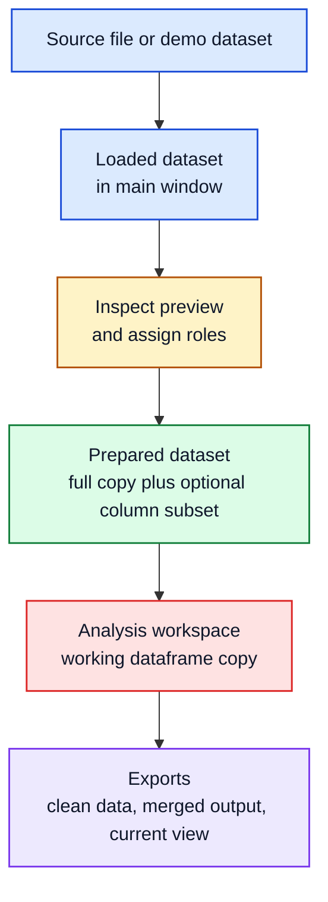

# Technical Overview

## Purpose

This document explains how the current EvalData application is divided at the repository level and how data moves through the application.

The current codebase centers on three layers:

- `EvalData.py` starts the desktop app from the repository root.
- `main_window/` and `analysis_workspace/` contain the two UI packages.
- `data_ops/`, `data_parser.py`, and `plot_utils.py` hold the reusable data, parsing, and plotting logic shared by those windows.

## Architecture Figure

The launcher at the repository root is intentionally thin. Nearly all application behavior now lives inside the packaged `main_window/` and `analysis_workspace/` modules, while the lower-level operations stay in reusable helpers.

Color convention in this document: blue = entry point, green = main preparation window, red = analysis workspace, violet = shared reusable logic.

Example: loading a file starts in `EvalData.py`, enters `main_window.app.main()`, and stays in the main window package until a selected prepared dataset is opened in `analysis_workspace/window.py`.

## System Snapshot

`EvalData.py` owns startup only. The main window package owns dataset loading, preview, role assignment, prepared dataset creation, and subframe splitting. The analysis workspace package owns the working-copy analysis flow: filtering, derived signals, frequency analysis, cycle analysis, statistics, and export of the current working view. The shared data layer owns parsing, reusable dataframe operations, and common plotting helpers, but not Tkinter UI state.

For the short functional description of the user-visible analysis methods, see [analysis-methods.md](analysis-methods.md).

## Package Map

The main application window is implemented in `main_window/app.py` and supported by `layout.py`, `preview.py`, `preparation.py`, `datasets.py`, `plotting.py`, and `demo.py`. The per-dataset analysis workflow lives in `analysis_workspace/window.py` and is supported by `layout.py`, `refresh.py`, `actions.py`, `views.py`, and `state.py`. Reusable operations remain in `data_ops/`, while root-level support files such as `EvalData.py`, `data_parser.py`, `plot_utils.py`, and `deploy.py` handle launching, parsing, shared plotting, and packaging.

The `data_ops/` package contains:

| Module | Contents |
| --- | --- |
| `signals.py` | 7 signal filters (`moving_average`, `median`, `exponential_smoothing`, `high_pass`, `butterworth_lowpass`, `butterworth_highpass`, `butterworth_bandpass`) and 9 derived-signal operations (`delta`, `ratio`, `rolling_mean`, `derivative`, `normalized`, `detrend`, `integrate`, `rms_envelope`, `hilbert_envelope`) |
| `spectral.py` | 5 frequency-domain methods: FFT Amplitude, Welch PSD, Transfer Estimate, Coherence, Spectrogram |
| `cycles.py` | 4 cycle-detection modes: `fixed_length`, `rising_edge`, `zero_crossing`, `peak` |
| `frame_ops.py` | select, drop, slice, split, normalize columns, and `resample_to_uniform` |
| `summary.py` | Descriptive statistics (count, missing, min, max, mean, std, rms, peak-to-peak) and Pearson correlation matrix |
| `filtering.py` | Simple min/max filtering and column-name resolution |
| `io_ops.py` | CSV/merge export helpers |
| `models.py` | Shared data classes |

A test suite in `tests/` covers all `data_ops` modules with 131 tests.

## Main Window Package

`main_window/app.py` is the top-level orchestrator for the main window. `layout.py` builds the Tk layout, `preview.py` renders the table and overview plot, `preparation.py` handles prepared datasets and explicit subframe splits, `datasets.py` manages lineage and role-aware helpers, `plotting.py` opens detached figure windows, and `demo.py` provides deterministic demo datasets.

## Analysis Workspace Package

`analysis_workspace/window.py` owns the main analysis session window. `layout.py` builds the analysis UI, `refresh.py` updates it based on the current dataframe and selected columns, `actions.py` applies reusable dataframe updates, `views.py` renders preview/statistics/correlation/cycle widgets, and `state.py` stores shared constants and session structures.

Important current boundary: the frequency tab exposes `FFT Amplitude`, `Welch PSD`, `Transfer Estimate`, `Coherence`, and `Spectrogram` in the UI. Transfer Estimate and Coherence require a comparison column. Spectrogram produces a time-frequency heatmap instead of a single spectrum plot.

## Dataset Lifecycle

Files are parsed into in-memory dataframes and registered in the main window. The selected dataset can then be inspected and labeled semantically. Prepared dataset creation currently copies the selected dataframe and may reduce it to a chosen column subset. A selected prepared dataset can then be opened in the analysis workspace, where a separate working dataframe is used for transformations and exports.

## Important Current Semantics

- Prepared dataset creation does not trim rows based on the overview plot.
- Column reduction is optional and driven by channel selection.
- Explicit row-window splitting belongs to `Preparation -> Split Into Subframes`.
- The overview plot is an inspection aid only.
- The analysis workspace uses a working dataframe copy instead of editing the original dataset in place.

## Runtime Flow

1. `EvalData.py` starts `main_window.app.main()`.
2. The main window loads or generates datasets through `data_parser.py` or `main_window/demo.py`.
3. `main_window/datasets.py` registers lineage and role information.
4. `main_window/preview.py` renders the preview table and overview plot.
5. `main_window/preparation.py` creates prepared datasets or explicit subframe splits.
6. `analysis_workspace/window.py` opens the detailed analysis session.
7. `analysis_workspace/actions.py` applies analysis operations using `data_ops/*`.
8. `analysis_workspace/views.py` and `plot_utils.py` render plots, spectra, cycle views, and summaries.

That split matters because UI state stays in the window packages, while the reusable calculations stay in `data_ops/*`.

## Packaging And Build

`requirements.txt` defines the dependency baseline. `deploy.py` is the convenience bootstrap/build script. `EvalData.spec` supports PyInstaller packaging work. `.vscode/launch.json` provides a shared debug configuration that starts `EvalData.py` from the repository root.

## Validation Status

This repository is not meaningfully validated.

Editor diagnostics, ad-hoc import checks, and compile-time checks help catch syntax and packaging failures, but they do not prove correct parsing, correct transformations, correct spectra, correct exports, or trustworthy engineering interpretation. A test suite with 131 tests covers the `data_ops` modules and helps catch regressions, but passing tests are not a substitute for domain-specific validation. The demo datasets are useful control cases for exploration, not evidence of general correctness. Manual exploration during development is likewise not a validation program.

## Documentation Notes

This technical overview is meant to stay aligned with the current code layout in `EvalData.py`, `main_window/`, `analysis_workspace/`, and `data_ops/`.

Use the Markdown docs for workflow and package orientation first, then link into [docs/latex/README.md](latex/README.md) when a method needs a deeper algorithm note or printable reference. The current formal example is [docs/latex/fft_welch_example.pdf](latex/fft_welch_example.pdf).

If those package boundaries change again, this document should be updated before adding more detail elsewhere in the documentation set.
