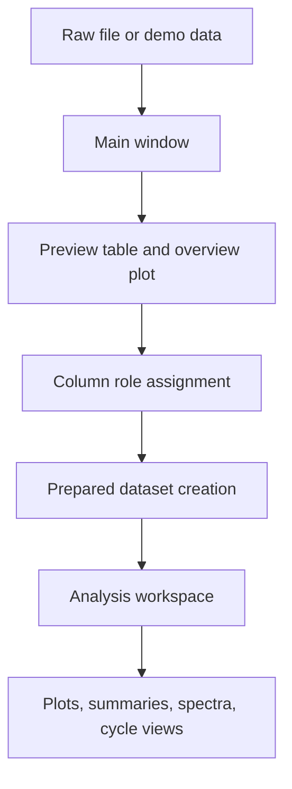
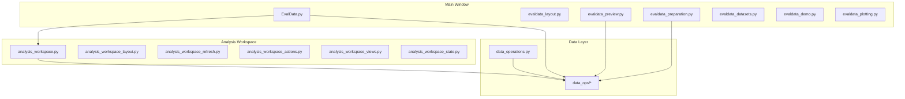

# Technical Overview

## Purpose

EvalData is a desktop workflow for moving from raw measurement tables to prepared datasets and focused analysis views.

The current design separates three concerns:

- application orchestration and UI state
- preparation and preview workflows
- reusable dataframe and signal-processing operations

## Workflow Diagram

## Main Flow

1. Load or generate a dataset in the main window.
2. Review the preview table and overview plot.
3. Assign or correct semantic column roles.
4. Use the visible overview range as the output range for prepared datasets.
5. Open a prepared dataset in the analysis workspace for detailed work.

## Module Structure

### Main Window

- `EvalData.py`: top-level application orchestration
- `evaldata_layout.py`: main window layout
- `evaldata_preview.py`: preview table and overview plot behavior
- `evaldata_preparation.py`: preparation commands and dataset creation
- `evaldata_datasets.py`: dataset registry, context, and role helpers
- `evaldata_demo.py`: built-in demo/test datasets
- `evaldata_plotting.py`: detached plotting helpers

### Analysis Workspace

- `analysis_workspace.py`: analysis window orchestration
- `analysis_workspace_layout.py`: analysis UI layout
- `analysis_workspace_refresh.py`: control refresh and state-dependent UI updates
- `analysis_workspace_actions.py`: reusable user action helpers
- `analysis_workspace_views.py`: preview/statistics/correlation rendering helpers
- `analysis_workspace_state.py`: constants and shared session structures

### Data Layer

- `data_ops/`: reusable dataframe, filtering, signal, spectral, cycle, summary, and I/O helpers
- `data_operations.py`: compatibility shim around the split data layer

## Current Simplification Direction

Recent cleanup intentionally reduced UI flexibility where it added too much state overhead.

Examples:

- preparation now centers on one prepared-dataset path instead of parallel keep/drop workflows
- the overview plot range is the effective output range
- the frequency UI is narrowed to the simpler visible workflows
- advanced operations are being pushed behind lighter defaults

## Packaging

- `requirements.txt` defines the current Python package baseline
- `deploy.py` bootstraps `.venv`, installs dependencies, and runs PyInstaller
- `EvalData.spec` is present for packaging-related work

## Validation Status

The repository does not yet contain an automated test suite.

Current validation is lightweight:

- editor error checks
- import smoke tests for main modules
- compile-time pass across the workspace

## Documentation Strategy

Markdown is the primary repo-facing format because it renders directly on Git hosting.

If deeper formal documentation becomes useful later, a separate LaTeX manual can be added without replacing the Markdown README.
