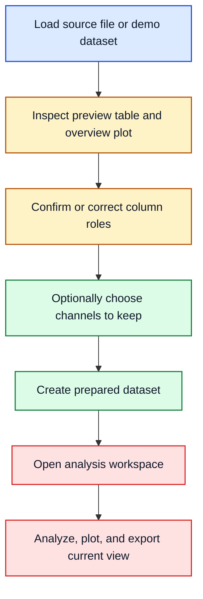
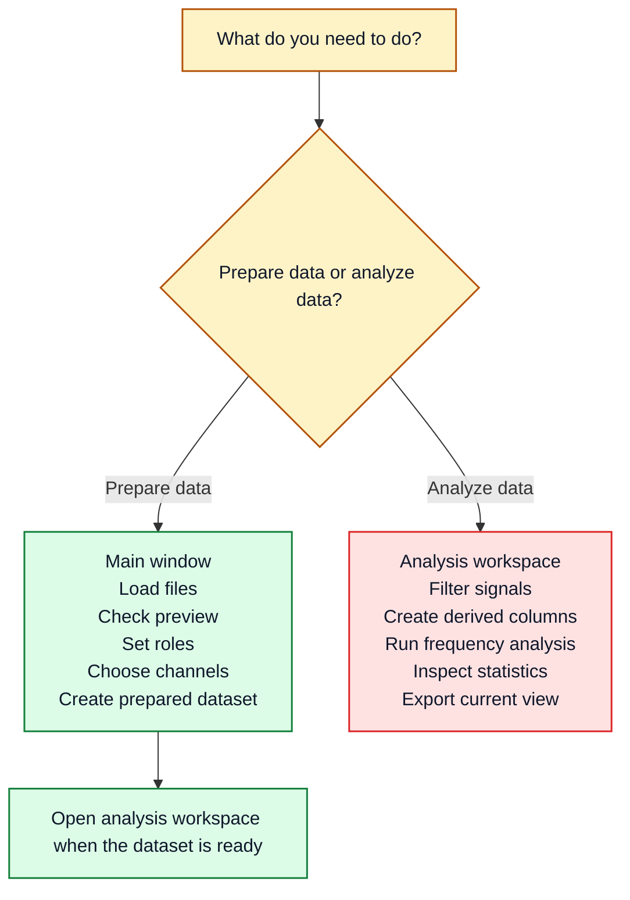

# User Guide

## Purpose

EvalData helps you move from raw measurement tables to prepared datasets and then into a focused analysis view.

In short: use the main window to get the data ready, then use the analysis workspace to inspect one selected dataset in detail.

The normal workflow is:

## Main Concepts

A dataset is one loaded table in the main window. A prepared dataset is a new in-app working copy derived from one selected source dataset. Column roles are lightweight semantic labels that help the app choose better defaults. The overview plot is primarily an inspection view and also supports drag-selecting row ranges for preparation. The analysis workspace is the place for detailed work on one dataset at a time.

## Plot Types

The application intentionally keeps plot families limited to four core types:

- `Preview Plot` in the main window (`Preview -> Plot`)
- `Time-series Plot` in the analysis workspace live plot area
- `Frequency Plot` in the analysis workspace result notebook
- `Cycle Plot` in the analysis workspace result notebook

There is also a `Plot Data` popup in the main window for quick ad-hoc inspection. Treat it as a utility window, not as an additional core plot type.

## Column Roles

| Role | Meaning | Typical columns | Used for |
| --- | --- | --- | --- |
| `time` | Reference axis for ordered samples | `time_s`, timestamp | Preferred plot X axis and frequency reference |
| `input` | Excitation, command, or forcing channel | actuator, drive, setpoint | Input-output comparisons |
| `output` | Measured response channel | measured displacement, pressure, response | Main response analysis |
| `signal` | Numeric analysis channel without a stronger semantic class | filtered copy, auxiliary sensor | General plotting and transformations |
| `metadata` | Context or labels rather than primary signals | ID, marker, label, temperature | Context, grouping, sanity checks |

Example: if `time_s` is marked as `time` and `measured_signal` is marked as `output`, plots and frequency analysis usually start with better defaults.

## Example Figures

    

Known spectral demo: the figure above is useful as a control case because the strongest expected FFT peaks are near 1.0 Hz, 7.5 Hz, and 18.0 Hz.

    

Same demo excerpt, different window choice: rectangular vs Hann.

If you want the formal background for the spectral views shown here, see [docs/latex/fft_welch_example.pdf](latex/fft_welch_example.pdf).

## Main Window Vs Analysis Workspace

## The Two Windows

The main window is for structural work: load files, inspect them, assign roles, choose which columns to carry forward, and create prepared datasets. If one source file contains several useful row windows, `Preparation -> Split Into Subframes` is the main-window tool for breaking it apart before analysis.

The analysis workspace is for detailed work on one selected dataset. The sidebar sets the active context, `Preview` lets you verify the current working dataframe, `Filter` (with sub-tabs for Simple Filtering, Signal Processing, and Resample) and `Derived Signals` change that working copy, `Frequency` and `Cycles` inspect behavior, and `Statistics` summarizes the result.

Where a deeper method note exists, the practical workflow should link to it. For frequency analysis, the current formal note is [docs/latex/fft_welch_example.pdf](latex/fft_welch_example.pdf).

Most of the visible options fall into a few groups: dataset name, channel selection, and role assignment in the main window; then active analysis column, plot axes, filter or derived-signal method, frequency method, and cycle mode in the analysis workspace. If the app seems to pick the wrong default, one of those settings is usually the reason.

## Step 1: Load Data

Use one of these entry points from the main window:

- `Files -> Load Files` for your own data files
- `Files -> Load Demo/Test Signal` for built-in examples

If you want a structured manual validation pass using the built-in demos, see [demo-validation.md](demo-validation.md).

Supported source file types are documented in `data-formats.md`.

After loading, the dataset appears in the dataset list on the right side of the main window.

## Step 2: Inspect The Dataset

Select exactly one dataset to inspect it.

Use:

- `Info` for dataset summary and lineage information
- `Preview` for the preview table and overview plot

Check three things: the row and column count look reasonable, the likely time and signal columns are visible, and the overview plot broadly matches what you expect from the source data.

## Step 3: Confirm Column Roles

In the main window, use the `Roles` section below the core preparation controls.

Use the role table above as the working meaning of each label.

What changes when roles are correct:

- Better default X axis: `time_s` is preferred over `Index`.
- Better active analysis default: an `output` or `signal` column is favored.
- Better comparison choices: `input` can be paired against `output`.
- Better visual grouping: preview and role-aware controls become easier to scan.

If the current role guesses are poor, use `Reinfer Roles` and then correct anything important manually.

## Step 4: Choose The Output Columns

Use the main preparation section in the left-side controls.

The current prepared-dataset workflow is simple:

- enter an optional dataset name
- optionally choose which channels to keep
- click `Create Dataset` to create a new in-app dataset entry

If you do not select any channel subset, all columns are kept.

Important:

- Row-range filtering is optional during prepared dataset creation.
- Column trimming is optional via channel selection.
- You can fill row-range bounds manually or by dragging in the overview plot.
- For creating multiple explicit row windows in one step, use `Preparation -> Split Into Subframes`.

## Step 5: Create A Prepared Dataset

Still in the preparation controls:

1. enter a dataset name if you want something more descriptive than the default
2. leave or adjust the selected channels
3. click `Create Dataset`

This creates a new dataset entry inside the app.

It becomes a separately selectable dataset entry in the list. No new file is written automatically, lineage back to the source dataset is retained, and relevant role information is projected into the prepared copy where possible.

## Step 6: Use The Advanced Split Workflow If Needed

If one dataset contains repeated cycles or segments, open the `Advanced` tab.

Use `Split Into Subframes` when you already know the row ranges that should become separate dataset entries.

Use it when one file contains repeated runs, when you want one dataset per segment or cycle, or when you already know the row boundaries and want the split to be explicit and reproducible.

## Step 7: Open The Analysis Workspace

Select exactly one dataset, then use:

- `Analysis -> Open Analysis Workspace`

The analysis workspace is for detailed work on one dataset at a time.

The `Preview` tab shows the current working dataframe. `Filter` changes that working copy through three sub-tabs: Simple Filtering (min/max masking), Signal Processing (smoothing, high-pass, and Butterworth filters), and Resample (interpolation to a uniform time grid). `Derived Signals` creates new columns such as delta, derivative, detrend, integrate, rms_envelope, and hilbert_envelope. `Frequency` runs FFT Amplitude, Welch PSD, Transfer Estimate, Coherence, or Spectrogram. `Cycles` detects repeated segments via fixed_length, rising_edge, zero_crossing, or peak detection. `Statistics` summarizes the current state with statistics and correlation views.

If you want a focused read on cycle-analysis interpretation (what to read, where to find it, and how to judge quality), see [cycle-analysis-guide.md](cycle-analysis-guide.md).

## Step 8: Choose The Right Analysis Tool

Use the sidebar to choose the active analysis column first.

Then choose the appropriate tab:

- `Filter` when you want to clean, limit, smooth, or resample a signal
- `Derived Signals` when you want new columns based on an existing signal (delta, derivative, detrend, integrate, envelope, etc.)
- `Frequency` when you want to find repeating patterns, strong frequency content, input-output relationships, or time-varying spectral behavior
- `Cycles` when you want to segment repeating patterns based on fixed blocks, threshold crossings, zero crossings, or peak locations
- `Statistics` when you want distributions, summary values, or correlations

Example: if you mainly want to know whether a signal repeats strongly, go straight to `Frequency`. If you first need to smooth or clean the signal, start in `Filter` and then return to `Frequency`.

For the short method reference behind `Filter`, `Derived Signals`, `Frequency`, `Cycles`, and `Statistics`, see [analysis-methods.md](analysis-methods.md).

For the current technical note behind `FFT Amplitude` and `Welch PSD`, see [docs/latex/fft_welch_example.pdf](latex/fft_welch_example.pdf).

The `Filter` tab has three sub-tabs:

- **Simple Filtering**: mask values outside a min/max range on the active column.
- **Signal Processing**: apply smoothing, high-pass, or Butterworth filters (lowpass, highpass, bandpass). Butterworth filters use zero-phase `sosfiltfilt` and require cutoff frequency, sample spacing, and filter order.
- **Resample**: interpolate all numeric columns to a uniform time grid by specifying the time column and target spacing.

Some spacing/length fields are auto-filled from the active data until you edit them manually. These controls show a live badge:

- `Inferred` when the workspace is using a data-derived value
- `User-set` once you manually edit the field

This behavior applies to signal-processing sample spacing, FFT index step size, resample target spacing, Welch segment length, and fixed-cycle length.

For a fuller task-to-tool mapping, see `which-tool-when.md`.

## Step 9: Export Results

There are several export paths:

- `Files -> Export Clean Data`: writes cleaned versions of all currently loaded datasets to a chosen directory
- `Merge` workflow from the main window: saves a merged CSV file
- `Export Current View` in the analysis workspace: saves the current working dataframe as a CSV file

Export behavior is described in more detail in `data-formats.md`.

## Recommended Beginner Workflow

If you are unsure what to do, use this minimal routine:

1. load one dataset
2. confirm the preview looks right
3. set the time and main signal roles correctly
4. keep all columns or choose only the channels you want to carry forward
5. create a prepared dataset
6. open the prepared dataset in the analysis workspace
7. start with `Frequency` or `Statistics`

## When To Stop In The Main Window

Stay in the main window when the task is structural:

- load data
- rename or isolate the data you want to work with
- fix roles
- choose which columns to carry into a prepared dataset
- split one source dataset into several derived datasets

Move to the analysis workspace when the task becomes analytical:

- compare columns
- compute spectra
- filter or derive signals
- inspect statistics
- export the current working analysis state
