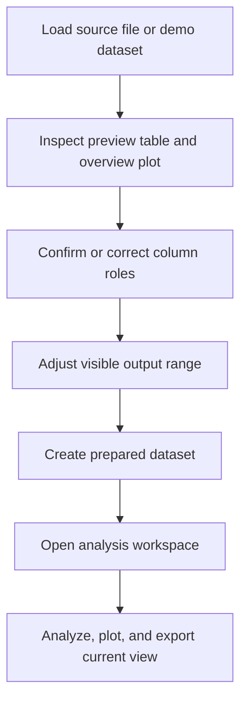
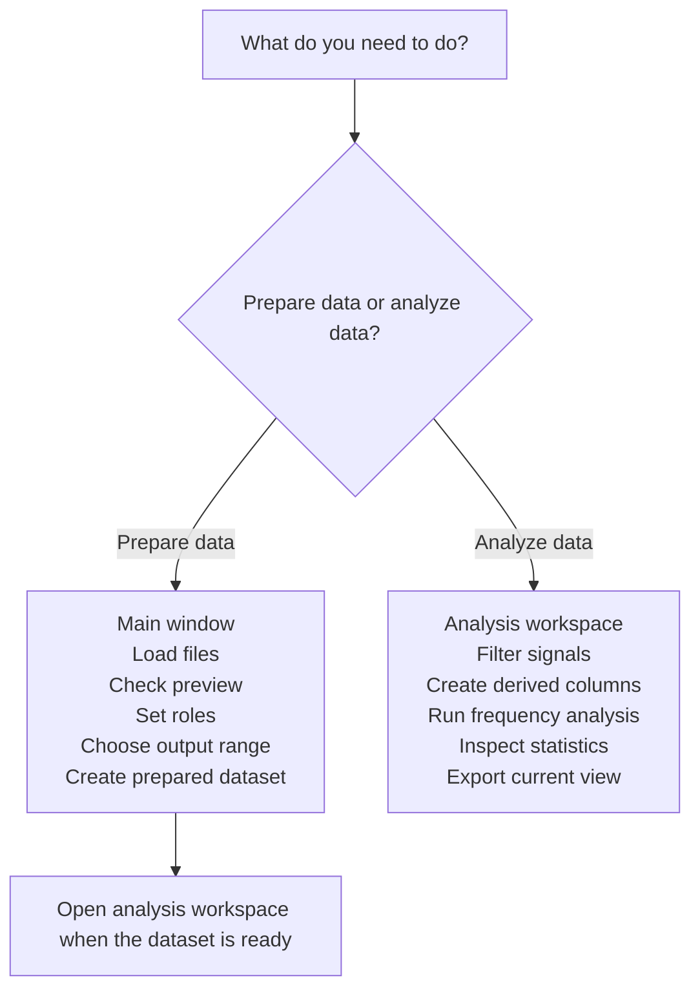

# User Guide

## Purpose

EvalData helps you move from raw measurement tables to prepared datasets and focused analysis views.

In plain terms:

- the main window is for getting the data ready
- the analysis workspace is for looking deeper into one prepared dataset

The normal workflow is:

## Main Concepts

- A dataset is one loaded table in the main window.
- A prepared dataset is a new dataset made from the currently selected source dataset.
- Column roles tell the app what each column is for, such as time, input, output, signal, or metadata.
- The overview plot range is the row range that will be used when you create a prepared dataset.
- The analysis workspace works on one selected dataset at a time.

## Main Window Vs Analysis Workspace

## Step 1: Load Data

Use one of these entry points from the main window:

- `Files -> Load Files` for your own data files
- `Files -> Load Demo/Test Signal` for built-in examples

Supported source file types are documented in `data-formats.md`.

After loading, the dataset appears in the dataset list on the right side of the main window.

## Step 2: Inspect The Dataset

Select exactly one dataset to inspect it.

Use:

- `Info` for dataset summary and lineage information
- `Preview` for the preview table and overview plot

At this stage, you are checking whether:

- the row count and columns look reasonable
- the likely time and signal columns are visible
- the overview plot shows the expected portion of the data

## Step 3: Confirm Column Roles

Open the `Roles` tab in the main window.

Use it to assign or correct roles such as:

- `time`
- `input`
- `output`
- `signal`
- `metadata`

Why this matters:

- plots choose better defaults when time and signal roles are correct
- the analysis workspace can select more sensible default columns
- summaries become easier to read

If the current role guesses are poor, use `Reinfer Roles` and then correct anything important manually.

## Step 4: Choose The Output Range

Open the `Prepare` tab.

The main rule is simple:

- what you currently see in the overview plot range is what becomes the prepared dataset output range

You can also optionally limit which channels are kept in the prepared dataset.

If you do not select any channel subset, all columns are kept.

## Step 5: Create A Prepared Dataset

Still in `Prepare`:

1. enter a dataset name if you want something more descriptive than the default
2. leave or adjust the selected channels
3. click `Create Dataset`

This creates a new dataset entry inside the app.

Think of it as creating a cleaned working copy inside the application.

Important:

- it is not automatically written as a new CSV file
- it keeps lineage information pointing back to the original dataset
- it preserves relevant column-role information where possible

## Step 6: Use The Advanced Split Workflow If Needed

If one dataset contains repeated cycles or segments, open the `Advanced` tab.

Use `Split Into Subframes` when you already know the row ranges that should become separate dataset entries.

This is useful when:

- one file contains several repeated runs
- you want one dataset per cycle or segment
- structural splitting is easier than analysis-time filtering

## Step 7: Open The Analysis Workspace

Select exactly one dataset, then use:

- `Analysis -> Open Analysis Workspace`

The analysis workspace is for detailed work on one dataset at a time.

If the main window answers "what part of the data do I want?", the analysis workspace answers "what does this data mean?"

Main areas:

- `Preview`: inspect the current working dataframe
- `Filter`: apply simple masking or signal-processing filters
- `Derived Signals`: create derived columns from the active signal
- `Frequency`: run FFT amplitude or Welch PSD
- `Cycles`: cycle-focused analysis tools
- `Statistics`: statistics and correlations

## Step 8: Choose The Right Analysis Tool

Use the sidebar to choose the active analysis column first.

Then choose the appropriate tab:

- `Filter` when you want to clean, limit, or smooth a signal
- `Derived Signals` when you want new columns based on an existing signal
- `Frequency` when you want to find repeating patterns or strong frequency content
- `Statistics` when you want distributions, summary values, or correlations

For a fuller task-to-tool mapping, see `which-tool-when.md`.

## Step 9: Export Results

There are several export paths:

- `Files -> Export Clean Data`: writes cleaned versions of all currently loaded datasets to a chosen directory
- `Merge` workflow from the main window: saves a merged CSV file
- `Export Current View` in the analysis workspace: saves the current working dataframe as a CSV file

Export behavior is described in more detail in `data-formats.md`.

## Recommended Beginner Workflow

If you are unsure what to do, use this minimal routine:

1. load one dataset
2. confirm the preview looks right
3. set the time and main signal roles correctly
4. trim the overview plot range if needed
5. create a prepared dataset
6. open the prepared dataset in the analysis workspace
7. start with `Frequency` or `Statistics`

## When To Stop In The Main Window

Stay in the main window when the task is structural:

- load data
- rename or isolate the data you want to work with
- fix roles
- choose the output range
- split one source dataset into several derived datasets

Move to the analysis workspace when the task becomes analytical:

- compare columns
- compute spectra
- filter or derive signals
- inspect statistics
- export the current working analysis state
