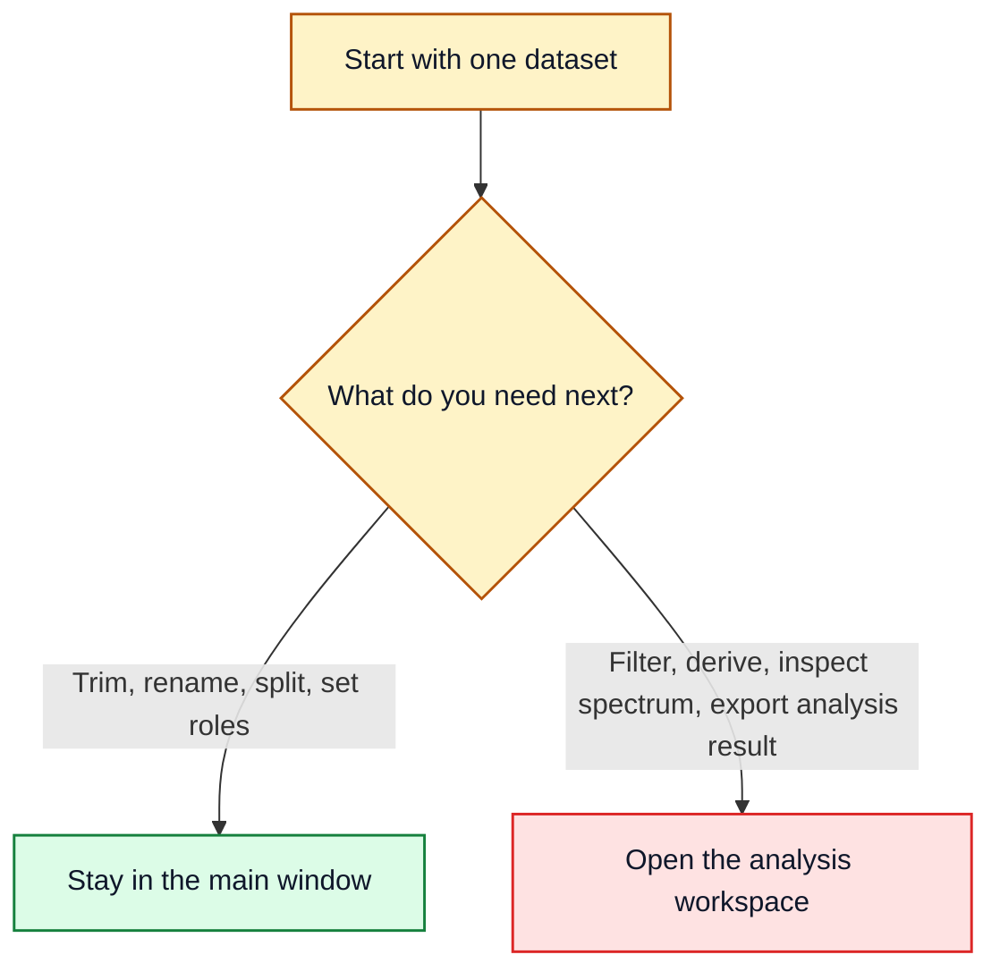

# Which Tool When

## Main Rule

Use the main window for structural preparation and the analysis workspace for detailed analysis.

## Main Window

- load measurement files or demo datasets
- inspect the raw data in the preview `Table` and `Plot` tabs
- assign or fix column roles
- choose which channels to keep in a prepared dataset
- keep only certain channels in a prepared dataset
- split one dataset into several sub-datasets
- create a new prepared dataset entry

Example: if you want a smaller working copy before analysis, stay in the main window.

## Analysis Workspace

- work deeply on one selected dataset
- update the live plot while switching columns
- apply simple numeric masking to the active column
- apply signal-processing filters such as smoothing, high-pass, or Butterworth (lowpass, highpass, bandpass)
- resample the working dataframe to a uniform time grid
- create derived columns (delta, ratio, derivative, detrend, integrate, rms_envelope, hilbert_envelope, etc.)
- run FFT Amplitude, Welch PSD, Transfer Estimate, Coherence, or Spectrogram
- inspect cycle-based metrics using fixed_length, rising_edge, zero_crossing, or peak detection
- inspect statistics, correlation, and cycle-related views
- export the current working dataframe

Example: if you already know which dataset you care about and now want to filter it, compare columns, or inspect the spectrum, move to the analysis workspace.

## Quick Choices

- Use `FFT Amplitude` when you want the clearest direct view of dominant frequencies.
- Use `Welch PSD` when the signal is noisy or you want a smoother frequency view.
- Use `Transfer Estimate` when you want the frequency response magnitude and phase between an input and output signal pair.
- Use `Coherence` when you want to check how linearly two signals are related at each frequency.
- Use `Spectrogram` when you want to see how frequency content changes over time.
- Use `Simple Filtering` when you want to hide values outside a numeric range.
- Use `Signal Processing` when you want smoothing or trend-removal behavior.
- Use a `Butterworth` filter when you need a frequency-selective filter with a defined cutoff and rolloff.
- Use `Resample` when your data has non-uniform time spacing and you need evenly spaced samples (e.g. before frequency analysis).
- Use `detrend` (in Derived Signals) when you want to remove slow polynomial drift before further analysis.
- Use `rms_envelope` or `hilbert_envelope` when you want the instantaneous amplitude or energy of a signal.
- Use `zero_crossing` or `peak` cycle modes when your cycles are naturally defined by sign changes or peak locations rather than fixed row counts or threshold crossings.

For the deeper method note behind the frequency options, see [docs/latex/fft_welch_example.pdf](latex/fft_welch_example.pdf).

## Typical Examples

- “I only want rows from the middle section of one recording.” Use `Preparation -> Split Into Subframes` in the main window.
- “I only want a few columns in the result.” Use the left-side `Preparation` controls in the main window.
- “I want to know whether the signal has a strong periodic component.” Open the analysis workspace and use `Frequency`.
- “I want to export the processed state after filtering.” Use `Export Current View` in the analysis workspace.- "My data has irregular time spacing and I need to run FFT." Use `Filter -> Resample` first to interpolate to a uniform grid, then switch to `Frequency`.
- "I want to know how my input signal relates to the output in the frequency domain." Use `Transfer Estimate` or `Coherence` with the input as the comparison column.
- "I want to see if the frequency content shifts during the recording." Use `Spectrogram`.
- "My signal has slow drift that I want to remove." Use `detrend` in `Derived Signals` or `butterworth_highpass` in `Signal Processing`.
- "I want to count how many oscillation cycles occur." Use `zero_crossing` or `peak` in `Cycles`.
- "I want the amplitude envelope of a vibration signal." Use `hilbert_envelope` or `rms_envelope` in `Derived Signals`.