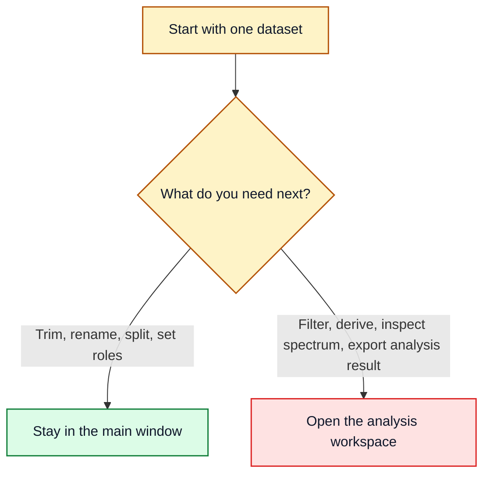

# Which Tool When

## Main Rule

Use the main window for structural preparation and the analysis workspace for detailed analysis.

## Main Window

- load measurement files or demo datasets
- inspect the raw data in the preview `Table` and `Plot` tabs
- assign or fix column roles
- choose which channels to keep in a prepared dataset
- keep only certain channels in a prepared dataset
- split one dataset into several sub-datasets
- create a new prepared dataset entry

Example: if you want a smaller working copy before analysis, stay in the main window.

## Analysis Workspace

- work deeply on one selected dataset
- update the live plot while switching columns
- apply simple numeric masking to the active column
- apply signal-processing filters such as smoothing or high-pass style cleanup
- create derived columns
- run FFT amplitude or Welch PSD
- inspect statistics, correlation, and cycle-related views
- export the current working dataframe

Example: if you already know which dataset you care about and now want to filter it, compare columns, or inspect the spectrum, move to the analysis workspace.

## Quick Choices

- Use `FFT Amplitude` when you want the clearest direct view of dominant frequencies.
- Use `Welch PSD` when the signal is noisy or you want a smoother frequency view.
- Use `Simple Filtering` when you want to hide values outside a numeric range.
- Use `Signal Processing` when you want smoothing or trend-removal behavior.

For the deeper method note behind the two frequency options, see [docs/latex/fft_welch_example.pdf](latex/fft_welch_example.pdf).

## Typical Examples

- “I only want rows from the middle section of one recording.” Use `Preparation -> Split Into Subframes` in the main window.
- “I only want a few columns in the result.” Use the left-side `Preparation` controls in the main window.
- “I want to know whether the signal has a strong periodic component.” Open the analysis workspace and use `Frequency`.
- “I want to export the processed state after filtering.” Use `Export Current View` in the analysis workspace.
