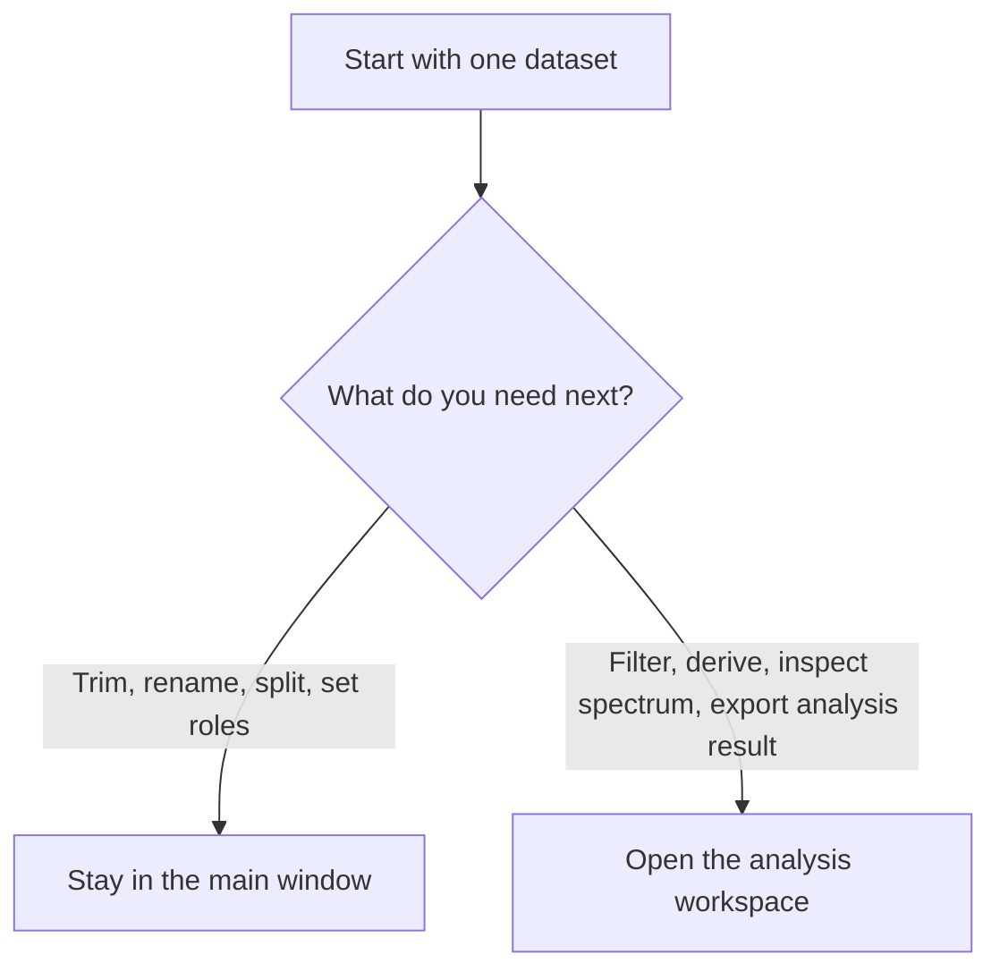

# Which Tool When

## Main Rule

Use the main window for structural preparation and the analysis workspace for detailed analysis.

## Use The Main Window When You Need To

- load measurement files or demo datasets
- inspect the raw table and overview plot
- assign or fix column roles
- choose the output row range
- keep only certain channels in a prepared dataset
- split one dataset into several sub-datasets
- create a new prepared dataset entry

## Use The Analysis Workspace When You Need To

- work deeply on one selected dataset
- update the live plot while switching columns
- apply simple numeric masking to the active column
- apply signal-processing filters such as smoothing or high-pass style cleanup
- create derived columns
- run FFT amplitude or Welch PSD
- inspect statistics, correlation, and cycle-related views
- export the current working dataframe

## Choose Frequency Method Like This

- Use `FFT Amplitude` when you want the clearest direct view of dominant frequencies.
- Use `Welch PSD` when the signal is noisy or you want a smoother frequency view.

## Choose Filter Type Like This

- Use `Simple Filtering` when you want to hide values outside a numeric range.
- Use `Signal Processing` when you want smoothing or trend-removal behavior.

## Typical Examples

- “I only want rows from the middle section of one recording.” Use the main window and adjust the overview plot range.
- “I only want a few columns in the result.” Use the `Prepare` tab in the main window.
- “I want to know whether the signal has a strong periodic component.” Open the analysis workspace and use `Frequency`.
- “I want to export the processed state after filtering.” Use `Export Current View` in the analysis workspace.
